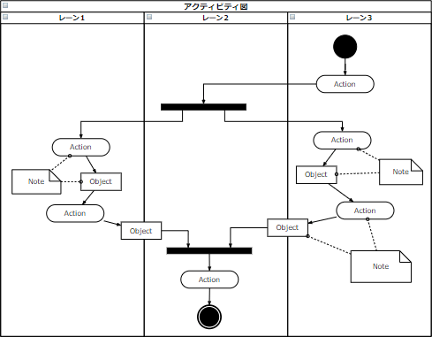

# [令和3年秋期 午前 問47](https://www.ap-siken.com/kakomon/03_aki/q47.html)

#問題 #テクノロジ #システム開発技術 #システム要件定義・ソフトウェア要件定義

解説を表示解説を隠す

<strong>問47</strong>　UMLにおける振る舞い図の説明のうち，アクティビティ図のものはどれか。

<ul class="ap-choices">
<li class="ap-choice-item ap-correct">

ア　ある振る舞いから次の振る舞いへの制御の流れを表現する。

正しい。アクティビティ図の説明です。

</li>
<li class="ap-choice-item ap-wrong">

イ　オブジェクト間の相互作用を時系列で表現する。

これはシーケンス図の説明です。

</li>
<li class="ap-choice-item ap-wrong">

ウ　システムが外部に提供する機能と，それを利用する者や外部システムとの関係を表現する。

これはユースケース図の説明です。

</li>
<li class="ap-choice-item ap-wrong">

エ　一つのオブジェクトの状態がイベントの発生や時間の経過とともにどのように変化するかを表現する。

これは状態遷移図の説明です。

</li>
</ul>

<h4>解説</h4>

アクティビティ図は、ビジネスプロセスの流れやプログラムの制御フローのような一連の手続きを可視化できる図です。フローチャートのUML版と言えるでしょう。フローチャートと似た表記法で処理の流れを記述できるほか、処理の分岐やマージ、並行処理のフォークやジョイン、タイマー制御や例外処理なども表現できるようになっています。

