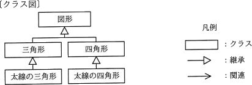
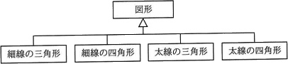
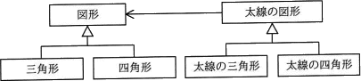
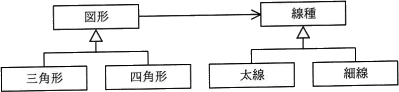
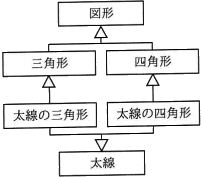

# [令和3年秋期 午前 問48](https://www.ap-siken.com/kakomon/03_aki/q48.html)

#問題 #テクノロジ #ソフトウェア開発管理技術 #開発プロセス・手法

解説を表示解説を隠す

<strong>問48</strong>　図は，ある図形描画ツールのクラス図の一部である。新たな形状や線種で図形を描画する機能の追加を容易にするために，リファクタリング"継承の分割"を行った。変更後のクラス図はどれか。 

<ul class="ap-choices">
<li class="ap-choice-item ap-wrong">

ア　

太線に加えて形状のコードも重複することになるため、リファクタリングになっていません。

</li>
<li class="ap-choice-item ap-wrong">

イ　

形状を追加しようとするときに線種の数だけクラスを追加しなければならず、線種を追加しようとするときに形状の数だけクラスを作らなければならないので、適切ではありません。

</li>
<li class="ap-choice-item ap-correct">

ウ　

正しい。線種を図形から分離し、図形に線種を保持させているため"継承の分割"に当たります。乱れた継承が解消され、図形を追加するときも、線種を追加するときも、また別の描画機能を追加するのも容易になっています。

</li>
<li class="ap-choice-item ap-wrong">

エ　

"インタフェースの抽出"によるリファクタリングですが、重複したコードはそのままですので機能の追加の容易さは変わりません。

</li>
</ul>

<h4>解説</h4>

"継承の分割"は、1つの継承階層で、2つの仕事をまとめて行っているときに、継承階層を2つに分け、一方を委譲によって呼び出すように再構成するリファクタリングのテクニックです。設問のクラス図を見ると、図形の継承階層において形状と線種の2つの仕事を行っているため、サブクラスで太線の描画機能に関するコードの重複が生じていることがわかります。コードの重複は機能の追加や変更を困難にする弊害があるため、これを解消することが目的となります。"継承の分割"では、補助的な仕事をするクラス及び継承階層を作成し、そのインスタンスを共通のスーパークラスに変数として持たせます。そして補助的な仕事をするクラスにサブクラスの変数やメソッドを移動します。サブクラスで保持する変数やメソッドがなくなれば、そのサブクラスは削除することができます。

