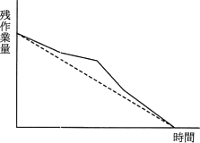
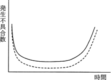
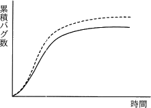
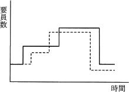
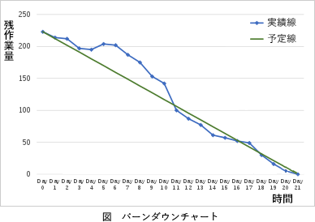

# [令和3年秋期 午前 問49](https://www.ap-siken.com/kakomon/03_aki/q49.html)

#問題 #テクノロジ #ソフトウェア開発管理技術 #開発プロセス・手法

解説を表示解説を隠す

<strong>問49</strong>　アジャイル開発におけるプラクティスの一つであるバーンダウンチャートはどれか。ここで，図中の破線は予定又は予想を，実線は実績を表す。

<ul class="ap-choices">
<li class="ap-choice-item ap-correct">

ア　

正しい。バーンダウンチャートです。

</li>
<li class="ap-choice-item ap-wrong">

イ　

これは故障率曲線の説明です。

</li>
<li class="ap-choice-item ap-wrong">

ウ　

バグ管理図です。

</li>
<li class="ap-choice-item ap-wrong">

エ　

要員ヒストグラムです。

</li>
</ul>

<h4>解説</h4>

バーンダウンチャートは、縦軸に「残作業量」、横軸に「時間」を取った折れ線グラフです。実績をプロットしていくことで、残作業量や予定との差異を視覚的に把握できるようにした図です。イテレーションの進行に伴い残作業量は減っていくため、基本的には右肩下がりのグラフになります。バーンダウンチャートでは、作業開始時の最大作業量から目標となるリリース日もしくはイテレーション終了日までを直線で結び、理想的な作業進行を表す予定線を書いておきます。イテレーションや作業日の終わりに実績をプロットしていく際に、この予定線より上となる場合は計画より作業が遅れている、予定線より下となる場合は計画より作業が進んでいる、と判断することができます。バーンダウンチャートを作成することによって、プロジェクトの明確な進捗状況をチーム内で共有できるため、適切な対策を適切なタイミングで実施できるようになる効果があります。

