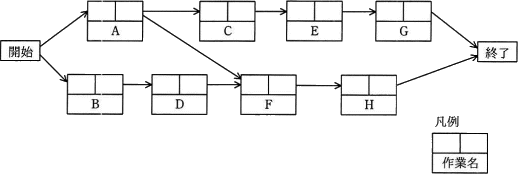
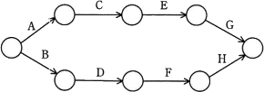
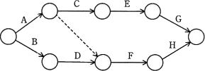
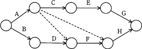
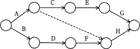

# [令和3年秋期 午前 問52](https://www.ap-siken.com/kakomon/03_aki/q52.html)

#問題 #マネジメント #プロジェクトマネジメント #プロジェクトの時間

解説を表示解説を隠す

<strong>問52</strong>　次のプレシデンスダイアグラムで表現されたプロジェクトスケジュールネットワーク図を，アローダイアグラムに書き直したものはどれか。ここで，プレシデンスダイアグラムの依存関係は全てFS関係とする。 

<ul class="ap-choices">
<li class="ap-choice-item ap-wrong">

ア　

作業Aと作業FのFS関係が表現されていないので誤りです。

</li>
<li class="ap-choice-item ap-correct">

イ　

正しい。

</li>
<li class="ap-choice-item ap-wrong">

ウ　

プレシデンスダイアグラムに存在しない作業Aと作業HのFS関係が記述されているため誤りです。

</li>
<li class="ap-choice-item ap-wrong">

エ　

この図のダミー作業線は、作業Aと作業HのFS関係を表すため誤りです。

</li>
</ul>

<h4>解説</h4>

プレシデンスダイアグラム法(PDM法)は、個々の作業を四角で囲み、作業同士を矢印で結ぶことで作業順序や依存関係を表現する図法です。作業同士の関係を表すという意味ではアローダイアグラムと同じですが、アローダイアグラムでは作業を矢印で結合点を丸のノードで示すので、記述方法が根本的に異なります。またアローダイアグラムでは、ある作業の終了が別の作業の開始条件となる「終了－開始」(FS：Finish to Start)の依存関係しか表現できませんが、プレシデンスダイアグラムではこの他に、「開始-開始」(SS：Start to Start)、「開始-終了」(SF：Start to Finish)、「終了-終了」(FF：Finish to Finish)の関係を記述できることが特徴です。本設問のFS関係とは「ある作業の終了が別の作業の開始条件となっている関係」を意味しており、アローダイアグラムの矢印で示される依存関係がこれに相当します。選択肢の各図は基本的には同じ造りであり、異なるのはダミー作業を表す点線のみです。プレシデンスダイアグラムの矢印に注目すると、作業Aと作業Dからの矢印が作業Fに向かって伸びています。これは、作業Fの開始条件が作業Aおよび作業Dの両方の完了であることを示しています。すなわちアローダイアグラムの中で、作業Aの結合点からのダミー作業線および作業Dの矢印が、作業F開始の結合点に向かって記述されている「イ」が適切です。

