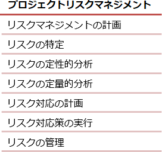

# [令和3年秋期 午前 問53](https://www.ap-siken.com/kakomon/03_aki/q53.html)

#問題 #マネジメント #プロジェクトマネジメント #プロジェクトのリスク

解説を表示解説を隠す

<strong>問53</strong>　PMBOKガイド第6版によれば，リスクの定量的分析で実施することはどれか。

<ul class="ap-choices">
<li class="ap-choice-item ap-wrong">

ア　発生の可能性や影響のみならず他の特性を評価することによって，さらなる分析や行動のためにプロジェクトの個別リスクに優先順位を付ける。

<a href="用語/リスクの定性的分析" class="internal-link" data-href="用語/リスクの定性的分析">リスクの定性的分析</a>で実施することです。本肢の説明がそのまま<a href="用語/PMBOK" class="internal-link" data-href="用語/PMBOK">PMBOK</a>ガイド第6版による"<a href="用語/リスクの定性的分析" class="internal-link" data-href="用語/リスクの定性的分析">リスクの定性的分析</a>"の定義に相当します。

</li>
<li class="ap-choice-item ap-correct">

イ　プロジェクトの個別の特定した個別リスクと，プロジェクト目標全体における他の不確実性要因が複合した影響を数量的に分析する。

正しい。<a href="用語/リスクの定量的分析" class="internal-link" data-href="用語/リスクの定量的分析">リスクの定量的分析</a>で実施することです。

</li>
<li class="ap-choice-item ap-wrong">

ウ　プロジェクトの全体リスクとプロジェクトの個別リスクに対処するために，選択肢の策定，戦略の選択，及び対応処置を合意する。

<a href="用語/リスク対応" class="internal-link" data-href="用語/リスク対応">リスク対応</a>の計画で実施することです。

</li>
<li class="ap-choice-item ap-wrong">

エ　プロジェクトの全体リスクの要因だけでなくプロジェクトの個別リスクの要因も特定し，それぞれの特性を文書化する。

<a href="用語/リスクの特定" class="internal-link" data-href="用語/リスクの特定">リスクの特定</a>で実施することです。

</li>
</ul>

<h4>解説</h4>

<a href="用語/PMBOK" class="internal-link" data-href="用語/PMBOK">PMBOK</a>ガイド第6版によれば、プロジェクトリスクマネジメントは複数のプロセスが含まれます。定量的評価とはリスクの大きさを金額（数値）で表す評価手法です。これに対して定性的評価はランク付けやレベルなどの金額以外で表す手法になります。<a href="用語/リスクの定性的分析" class="internal-link" data-href="用語/リスクの定性的分析">リスクの定性的分析</a>では、各リスクについて発生確率・影響度マトリクスを使用して「高」「中」「低」などに分類したり、階層構造図を使用してバブルの大きさで表したりして、<a href="用語/リスク対応" class="internal-link" data-href="用語/リスク対応">リスク対応</a>の優先度を数量以外の情報で把握することを目的とします。<a href="用語/リスクの定量的分析" class="internal-link" data-href="用語/リスクの定量的分析">リスクの定量的分析</a>では、<a href="用語/シミュレーション" class="internal-link" data-href="用語/シミュレーション">シミュレーション</a>、<a href="用語/感度分析" class="internal-link" data-href="用語/感度分析">感度分析</a>、<a href="用語/デシジョンツリー" class="internal-link" data-href="用語/デシジョンツリー">デシジョンツリー</a>分析などを使用し、リスクがプロジェクトに与える影響を数量的に把握することを目的とします。

