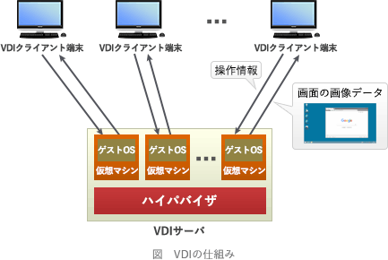

# [令和3年秋期 午前 問61](https://www.ap-siken.com/kakomon/03_aki/q61.html)

#問題 #ストラテジ #システム戦略 #ソリューションビジネス

解説を表示解説を隠す

<strong>問61</strong>　テレワークで活用しているVDIに関する記述として，適切なものはどれか。

<ul class="ap-choices">
<li class="ap-choice-item ap-correct">

ア　PC環境を仮想化してサーバ上に置くことで，社外から端末の種類を選ばず自分のデスクトップPC環境として利用できるシステム

正しい。<a href="用語/VDI" class="internal-link" data-href="用語/VDI">VDI</a>は、仮想デスクトップ環境を提供する技術です。

</li>
<li class="ap-choice-item ap-wrong">

イ　インターネット上に仮想の専用線を設定し，特定の人だけが利用できる専用ネットワーク

VPN(Virtual Private Network)の説明です。

</li>
<li class="ap-choice-item ap-wrong">

ウ　紙で保管されている資料を，ネットワークを介して遠隔地からでも参照可能な電子書類に変換・保存することができるツール

スキャナーや文書管理システムの説明です。

</li>
<li class="ap-choice-item ap-wrong">

エ　対面での会議開催が困難な場合に，ネットワークを介して対面と同じようなコミュニケーションができるツール

テレビ（ビデオ）会議システムの説明です。

</li>
</ul>

<h4>解説</h4>

<a href="用語/VDI" class="internal-link" data-href="用語/VDI">VDI</a>(Virtual Desktop Infrastructure，仮想デスクトップ基盤)は，サーバ内にクライアントごとの仮想マシンを用意して仮想デスクトップ環境を構築する技術です。利用者はネットワークを通じて<a href="用語/VDI" class="internal-link" data-href="用語/VDI">VDI</a>サーバ上の仮想デスクトップ環境に接続し、クライアントPCには<a href="用語/VDI" class="internal-link" data-href="用語/VDI">VDI</a>サーバからの操作結果画面のみが転送される仕組みになっています。この仕組みにより、クライアントがインターネット上のサイトと直接的な通信を行わなくなるので、クライアントPCをインターネットから分離できます。もし、利用者の操作により不正なマルウェアをダウンロードしてしまったとしても、それが保存されるのは<a href="用語/VDI" class="internal-link" data-href="用語/VDI">VDI</a>サーバ上の仮想環境ですので、クライアントPCへの感染を防げます。汚染された仮想環境を削除してしまえば<a href="用語/VDI" class="internal-link" data-href="用語/VDI">VDI</a>サーバへの影響もありません。

