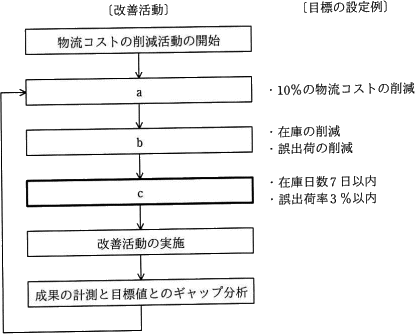

# [令和3年秋期 午前 問62](https://www.ap-siken.com/kakomon/03_aki/q62.html)

#問題 #ストラテジ #経営戦略マネジメント #ビジネス戦略と目標・評価

解説を表示解説を隠す

<strong>問62</strong>　物流業務において，10%の物流コストの削減の目標を立てて，図のような業務プロセスの改善活動を実施している。図中のcに相当する活動はどれか。 

<ul class="ap-choices">
<li class="ap-choice-item ap-wrong">

ア　CSF(Critical Success Factor)の抽出

bで設定した目標達成のための重要な手段の策定に相当します。

</li>
<li class="ap-choice-item ap-wrong">

イ　KGI(Key Goal Indicator)の設定

aで設定した最終的な目標値(10%削減)に相当します。

</li>
<li class="ap-choice-item ap-correct">

ウ　KPI(Key Performance Indicator)の設定

正しい。プロセスがどの程度達成できているかをモニタリングする指標の設定です。

</li>
<li class="ap-choice-item ap-wrong">

エ　MBO(Management by Objectives)の導入

目標による管理の手法であり、図中のcには該当しません。

</li>
</ul>

<h4>解説</h4>

物流コストの削減を目的に改善活動を開始し、aで設定した最終的な目標値(10%削減)に向かって継続的な改善活動を行うサイクルを表しています。bでは、10%削減の目標を実現するための重要となる手段を策定し、cでは、bで設定した目標達成のためのプロセスがどの程度達成できているかをモニタリングする指標を設定しています。a → <a href="用語/KGI" class="internal-link" data-href="用語/KGI">KGI</a>の設定、b → <a href="用語/CSF" class="internal-link" data-href="用語/CSF">CSF</a>の抽出、c → <a href="用語/KPI" class="internal-link" data-href="用語/KPI">KPI</a>の設定となるため正解は「ウ」です。

