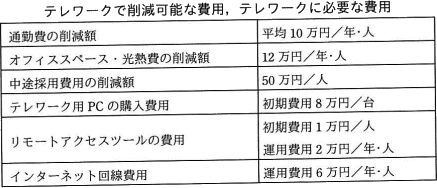

# [令和3年秋期 午前 問64](https://www.ap-siken.com/kakomon/03_aki/q64.html)

#問題 #ストラテジ #システム戦略 #システム活用促進・評価

解説を表示解説を隠す

<strong>問64</strong>　A社は，社員10名を対象に，ICT活用によるテレワークを導入しようとしている。テレワーク導入後5年間の効果("テレワークで削減可能な費用"から"テレワークに必要な費用"を差し引いた額)の合計は何万円か。 〔テレワークの概要〕テレワーク対象者は，リモートアクセスツールを利用して，テレワーク用PCから社内システムにインターネット経由でアクセスして，フルタイムで在宅勤務を行う。テレワーク用PCの購入費用，リモートアクセスツールの費用，自宅・会社間のインターネット回線費用は会社が負担する。テレワークを導入しない場合は，育児・介護理由によって，毎年1名の離職が発生する。フルタイムの在宅勤務制度を導入した場合は，離職を防止できる。離職が発生した場合は，その補充のために中途採用が必要となる。テレワーク対象者分の通勤費とオフィススペース・光熱費が削減できる。在宅勤務によって，従来，通勤に要していた時間が削減できるが，その効果は考慮しない。 

<ul class="ap-choices">
<li class="ap-choice-item ap-wrong">

ア　610

効果額は860万円です。

</li>
<li class="ap-choice-item ap-correct">

イ　860

正しい。1,350万円－490万円＝860万円。

</li>
<li class="ap-choice-item ap-wrong">

ウ　950

効果額は860万円です。

</li>
<li class="ap-choice-item ap-wrong">

エ　1,260

効果額は860万円です。

</li>
</ul>

<h4>解説</h4>

【<a href="用語/テレワーク" class="internal-link" data-href="用語/テレワーク">テレワーク</a>で削減可能な費用】通勤費の削減額　10万円×5年×10人＝500万円、オフィススペース・光熱費の削減額　12万円×5年×10人＝600万円、中途採用費用の削減額　50万円×1人×5年＝250万円、削減費用合計　1,350万円。【<a href="用語/テレワーク" class="internal-link" data-href="用語/テレワーク">テレワーク</a>に必要な費用】<a href="用語/テレワーク" class="internal-link" data-href="用語/テレワーク">テレワーク</a>用PCの購入費用　8万円×10人＝80万円、リモートアクセスツールの初期費用　1万円×10人＝10万円、運用費用　2万円×5年×10人＝100万円、インターネット回線費用　6万円×5年×10人＝300万円、<a href="用語/テレワーク" class="internal-link" data-href="用語/テレワーク">テレワーク</a>費用合計　490万円。以上より効果額は、1,350万円－490万円＝860万円。したがって「イ」が正解です。

