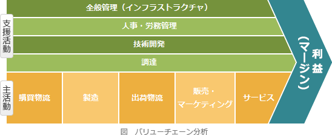

# [令和3年秋期 午前 問67](https://www.ap-siken.com/kakomon/03_aki/q67.html)

#問題 #ストラテジ #経営戦略マネジメント #経営戦略手法

解説を表示解説を隠す

<strong>問67</strong>　バリューチェーンの説明はどれか。

<ul class="ap-choices">
<li class="ap-choice-item ap-correct">

ア　企業活動を，五つの主活動と四つの支援活動に区分し，企業の競争優位の源泉を分析するフレームワーク

正しい。バリューチェーンの説明です。

</li>
<li class="ap-choice-item ap-wrong">

イ　企業の内部環境と外部環境を分析し，自社の強みと弱み，自社を取り巻く機会と脅威を整理し明確にする手法

SWOT分析の説明です。

</li>
<li class="ap-choice-item ap-wrong">

ウ　財務，顧客，内部ビジネスプロセス，学習と成長の四つの視点から企業を分析し，戦略マップを策定するフレームワーク

バランススコアカードの説明です。

</li>
<li class="ap-choice-item ap-wrong">

エ　商品やサービスを，誰に，何を，どのように提供するかを分析し，事業領域を明確にする手法

CFT分析（顧客・機能・技術）の説明です。

</li>
</ul>

<h4>解説</h4>

バリューチェーンとは、マイケル・ポーターの<a href="用語/競争戦略" class="internal-link" data-href="用語/競争戦略">競争戦略</a>の中で提唱されたフレームワークで、事業活動を価値創造活動の集合と捉え、製品の<a href="用語/付加価値" class="internal-link" data-href="用語/付加価値">付加価値</a>がどの部分（機能）で生み出されているかを分析し、その価値の連鎖を最適化するためのフレームワークです。業務を「購買物流」「製造」「出荷物流」「販売・マーケティング」「サービス」という5つの主活動と、「調達」「技術開発」「人事・労務管理」「全般管理」の4つの支援活動に分類して、主活動の効率を上げることで他企業との<a href="用語/競争優位" class="internal-link" data-href="用語/競争優位">競争優位</a>を確立しようとします。

