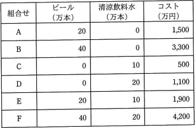

# [令和3年秋期 午前 問68](https://www.ap-siken.com/kakomon/03_aki/q68.html)

#問題 #ストラテジ #経営戦略マネジメント #経営戦略手法

解説を表示解説を隠す

<strong>問68</strong>　あるメーカーがビールと清涼飲料水を生産する場合，表に示すように6種類のケース(A～F)によって異なるコストが掛かる。このメーカーの両製品の生産活動におけるスケールメリットとシナジー効果についての記述のうち，適切なものはどれか。 

<ul class="ap-choices">
<li class="ap-choice-item ap-wrong">

ア　スケールメリットはあるが，シナジー効果はない。

大量生産でも製品当たりのコストは割高になっており、スケールメリットはありません。

</li>
<li class="ap-choice-item ap-correct">

イ　スケールメリットはないが，シナジー効果はある。

正しい。ケースE・Fで単体生産より割安になっています。

</li>
<li class="ap-choice-item ap-wrong">

ウ　スケールメリットとシナジー効果がともにある。

スケールメリットは確認できません。

</li>
<li class="ap-choice-item ap-wrong">

エ　スケールメリットとシナジー効果がともにない。

<a href="用語/シナジー効果" class="internal-link" data-href="用語/シナジー効果">シナジー効果</a>はケースE・Fで確認できます。

</li>
</ul>

<h4>解説</h4>

スケールメリットは生産規模を拡大するほど生産性や経済効率が向上することです。<a href="用語/シナジー効果" class="internal-link" data-href="用語/シナジー効果">シナジー効果</a>は2つ以上の要素が組み合わさることで、単体の効果の合計よりも大きな効果を得ることです。ビール・清涼飲料水とも大量生産でも製品当たりのコストは割高になっているのでスケールメリットはありません。ケースE・Fでは両製品を同時生産する方が単体生産の合計より割安なため<a href="用語/シナジー効果" class="internal-link" data-href="用語/シナジー効果">シナジー効果</a>があります。したがって「スケールメリットはないが、<a href="用語/シナジー効果" class="internal-link" data-href="用語/シナジー効果">シナジー効果</a>がある」が適切です。

