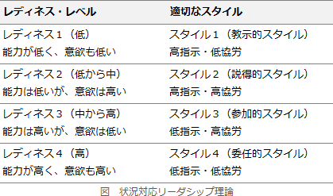

# [令和3年秋期 午前 問74](https://www.ap-siken.com/kakomon/03_aki/q74.html)

#問題 #ストラテジ #企業活動 #経営・組織論

解説を表示解説を隠す

<strong>問74</strong>　リーダーシップ論のうち，ハーシィ＆ブランチャードが提唱するSL理論の特徴はどれか。

<ul class="ap-choices">
<li class="ap-choice-item ap-wrong">

ア　優れたリーダーシップを発揮する，リーダー個人がもつ性格，知性，外観などの個人的資質の分析に焦点を当てている。

特性論的アプローチの説明です。

</li>
<li class="ap-choice-item ap-wrong">

イ　リーダーシップのスタイルについて，目標達成能力と集団維持能力の二つの次元に焦点を当てている。

PM理論の説明です。

</li>
<li class="ap-choice-item ap-correct">

ウ　リーダーシップの有効性は，部下の成熟(自律性)の度合いという状況要因に依存するとしている。

正しい。<a href="用語/SL理論" class="internal-link" data-href="用語/SL理論">SL理論</a>ではフォロワーの成熟度に依存する度合いが高いとしています。

</li>
<li class="ap-choice-item ap-wrong">

エ　リーダーシップの有効性は，リーダーがもつパーソナリティと，リーダーがどれだけ統制力や影響力を行使できるかという状況要因に依存するとしている。

コンティンジェンシー理論の説明です。

</li>
</ul>

<h4>解説</h4>

ハーシィ＆ブランチャードの<a href="用語/SL理論" class="internal-link" data-href="用語/SL理論">SL理論</a>（状況対応<a href="用語/リーダーシップ" class="internal-link" data-href="用語/リーダーシップ">リーダーシップ</a>理論）は、いかなる状況にも効果的な唯一万能のリーダー行動は存在しないという主張の下、<a href="用語/リーダーシップ" class="internal-link" data-href="用語/リーダーシップ">リーダーシップ</a>の有効性を状況との関係で捉え、状況要素のうち最も重要である部下や集団（フォロワー）の能力及び意欲の水準（レディネス）ごとに、有効性が高い<a href="用語/リーダーシップ" class="internal-link" data-href="用語/リーダーシップ">リーダーシップ</a>のスタイルを示したモデルです。部下に対する「指示の度合い」及び「協労の度合い」により、<a href="用語/リーダーシップ" class="internal-link" data-href="用語/リーダーシップ">リーダーシップ</a>のスタイルを教示的・説得的・参加的・委任的の4つに分類しています。

