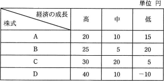

# [令和3年秋期 午前 問75](https://www.ap-siken.com/kakomon/03_aki/q75.html)

#問題 #ストラテジ #企業活動 #業務分析・データ利活用

解説を表示解説を隠す

<strong>問75</strong>　いずれも時価100円の株式A～Dのうち，一つの株式に投資したい。経済の成長を高，中，低の三つに区分したときのそれぞれの株式の予想値上がり幅は，表のとおりである。マクシミン原理に従うとき，どの株式に投資することになるか。 

<ul class="ap-choices">
<li class="ap-choice-item ap-correct">

ア　A

正しい。各株式の最小利得が最も大きいのはAです。

</li>
<li class="ap-choice-item ap-wrong">

イ　B

Bの最小利得はAより小さいです。

</li>
<li class="ap-choice-item ap-wrong">

ウ　C

Cの最小利得は－10円です。

</li>
<li class="ap-choice-item ap-wrong">

エ　D

Dの最小利得はAより小さいです。

</li>
</ul>

<h4>解説</h4>

<a href="用語/ゲーム理論" class="internal-link" data-href="用語/ゲーム理論">ゲーム理論</a>は、複数の人間による合理的な意思決定の方法を考える理論です。<a href="用語/マクシミン原理" class="internal-link" data-href="用語/マクシミン原理">マクシミン原理</a>は、各戦略を選択したときに得られる最小利得が最も大きくなる戦略を選ぶという保守的な考え方です。各株式の最小利得を比べたときに最も利益が大きくなるAに投資すると結論づけられます。したがって「ア」が正解です。

