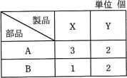
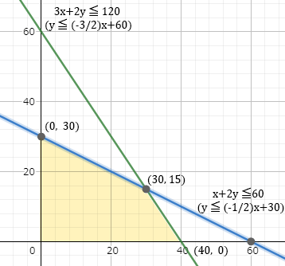

# [令和3年秋期 午前 問76](https://www.ap-siken.com/kakomon/03_aki/q76.html)

#問題 #ストラテジ #企業活動 #業務分析・データ利活用

解説を表示解説を隠す

<strong>問76</strong>　製品X，Yを1台製造するのに必要な部品数は，表のとおりである。製品1台当たりの利益がX，Yともに1万円のとき，利益は最大何万円になるか。ここで，部品Aは120個，部品Bは60個まで使えるものとする。 

<ul class="ap-choices">
<li class="ap-choice-item ap-wrong">

ア　30

部品を使い切ったときの最大生産数は45個です。

</li>
<li class="ap-choice-item ap-wrong">

イ　40

利益の最大額は45万円です。

</li>
<li class="ap-choice-item ap-correct">

ウ　45

正しい。製品X30個、製品Y15個で45万円。

</li>
<li class="ap-choice-item ap-wrong">

エ　60

利益の最大額は45万円です。

</li>
</ul>

<h4>解説</h4>

製品1台当たりの利益は同額であるため、部品を余すことなく使い、最も多く作ることのできる組合せが部品の最適配分となります。製品Xの生産数をx、製品Yの生産数をyとして、"x＋yの最大化"を目的関数とする<a href="用語/線形計画法" class="internal-link" data-href="用語/線形計画法">線形計画法</a>の問題として捉えることができます。部品A・Bを使い切るときのxとyは連立方程式で求め、x＝30、y＝15となります。製品1台当たりの利益は1万円ですから、利益の最大額は「ウ」の45万円となります。

