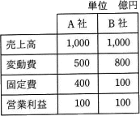
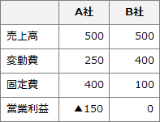

# [令和3年秋期 午前 問77](https://www.ap-siken.com/kakomon/03_aki/q77.html)

#問題 #ストラテジ #企業活動 #会計・財務

解説を表示解説を隠す

<strong>問77</strong>　A社とB社の比較表から分かる，A社の特徴はどれか。 

<ul class="ap-choices">
<li class="ap-choice-item ap-correct">

ア　売上高の増加が大きな利益に結びつきやすい。

正しい。A社は限界利益率が高いので、売上高の増加が大きな利益に結びつきやすいです。

</li>
<li class="ap-choice-item ap-wrong">

イ　限界利益率が低い。

限界利益率が低いのはB社です。

</li>
<li class="ap-choice-item ap-wrong">

ウ　損益分岐点が低い。

<a href="用語/損益分岐点" class="internal-link" data-href="用語/損益分岐点">損益分岐点</a>売上高が低いのはB社です。

</li>
<li class="ap-choice-item ap-wrong">

エ　不況時にも，売上高の減少が大きな損失に結びつかず不況抵抗力は強い。

A社は固定費が高いので、売上の減少が利益の減少に結びつきやすいです。

</li>
</ul>

<h4>解説</h4>

限界利益率は「(売上高－変動費)÷売上高」で計算します。A社は(1,000－500)÷1,000＝0.5、B社は(1,000－800)÷1,000＝0.2です。<a href="用語/損益分岐点" class="internal-link" data-href="用語/損益分岐点">損益分岐点</a>売上高は固定費÷(1－変動費率)で、A社は400÷(1－0.5)＝800、B社は100÷(1－0.8)＝500です。売上高が半分に減少した場合、A社は固定費が高いため売上の減少が利益の減少に結びつきやすいと言えます。

