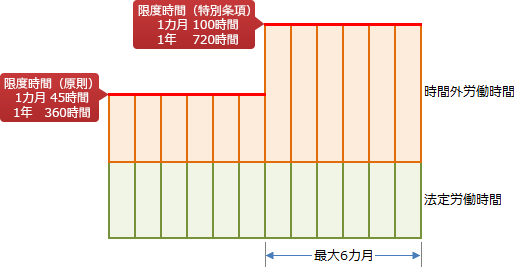

# [令和3年秋期 午前 問80](https://www.ap-siken.com/kakomon/03_aki/q80.html)

#問題 #ストラテジ #法務 #労働関連・取引関連法規

解説を表示解説を隠す

<strong>問80</strong>　労働基準法で定める36協定において，あらかじめ労働の内容や事情などを明記することによって，臨時的に限度時間の上限を超えて勤務させることが許される特別条項を適用する36協定届の事例として，適切なものはどれか。

<ul class="ap-choices">
<li class="ap-choice-item ap-correct">

ア　商品の売上が予想を超えたことによって，製造，出荷及び顧客サービスの作業量が増大したので，期間を3か月間とし，限度時間を超えて勤務する人数や所要時間を定めて特別条項を適用した。

正しい。予想外の出来事による業務量の増加、期間を3カ月と定めているなど条件を満たしています。

</li>
<li class="ap-choice-item ap-wrong">

イ　新技術を駆使した新商品の研究開発業務がピークとなり，3か月間の業務量が増大したので，労働させる必要があるために特別条項を適用した。

新技術・商品・役務の研究開発業務については36条11項により特別条項を適用できません。

</li>
<li class="ap-choice-item ap-wrong">

ウ　退職者の増加に伴い従業員一人当たりの業務量が増大したので，新規に要員を雇用できるまで，特に期限を定めずに特別条項を適用した。

1年のうち6カ月以内で通常の限度時間を超える月数を定めなくてはなりません。

</li>
<li class="ap-choice-item ap-wrong">

エ　慢性的な人手不足なので，増員を実施し，その効果を想定して1年間を期限とし，特別条項を適用した。

慢性的な労働人員の不足を事由として特別条項の適用を受けることはできません。

</li>
</ul>

<h4>解説</h4>

<a href="用語/労働基準法" class="internal-link" data-href="用語/労働基準法">労働基準法</a>では、災害その他避けることのできない事由によって臨時の必要がある場合を除き、法定労働時間を超えて労働させてはならないとしています。労使協定をし、所轄の労働基準監督署長に届け出た場合（<a href="用語/36協定" class="internal-link" data-href="用語/36協定">36協定</a>）には、その協定の定めるところにより超過労働が認められます。<a href="用語/36協定" class="internal-link" data-href="用語/36協定">36協定</a>で定める労働時間の限度は、通常業務の限度時間と、特別条項で定める限度時間の2段構成です。特別条項は、通常予見することのできない業務量の大幅な増大等に伴い臨時的に超過労働させる必要がある場合のみに適用でき、1年のうち6カ月以内で通常の限度時間を超える月数を定めなくてはなりません。

