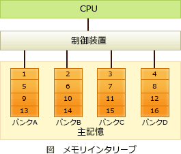

# [令和3年秋期 午前 問9](https://www.ap-siken.com/kakomon/03_aki/q9.html)

#問題 #テクノロジ #コンピュータ構成要素 #メモリ

解説を表示解説を隠す

<strong>問9</strong>　メモリインターリーブの説明として，適切なものはどれか。

<ul class="ap-choices">
<li class="ap-choice-item ap-wrong">

ア　主記憶と外部記憶を一元的にアドレス付けし，主記憶の物理容量を超えるメモリ空間を提供する。

これは<a href="用語/仮想記憶" class="internal-link" data-href="用語/仮想記憶">仮想記憶</a>の説明です。

</li>
<li class="ap-choice-item ap-wrong">

イ　主記憶と磁気ディスク装置との間にバッファメモリを置いて，双方のアクセス速度の差を補う。

ディスクバッファの説明です。

</li>
<li class="ap-choice-item ap-wrong">

ウ　主記憶と入出力装置との間でCPUとは独立にデータ転送を行う。

これは<a href="用語/DMA" class="internal-link" data-href="用語/DMA">DMA</a>の説明です。

</li>
<li class="ap-choice-item ap-correct">

エ　主記憶を複数のバンクに分けて，CPUからのアクセス要求を並列的に処理できるようにする。

正しい。メモリインターリーブの説明です。

</li>
</ul>

<h4>解説</h4>

メモリインターリーブは、物理上はひとつである<a href="用語/主記憶" class="internal-link" data-href="用語/主記憶">主記憶</a>領域を、同時アクセス可能な複数の論理的な領域（バンク）に分け、それぞれのバンクに対してデータの読み書きを並列で行うことにより、メモリアクセスの高速化を図る技術です。メモリインターリーブでは、奇数アドレスはバンク1、偶数アドレスはバンク2というように、連続したアドレスを複数のバンクに割り振っていきます。通常は、連続するアドレスに次々とアクセスされることが多いため、見かけ上並列アクセスしているようになり、実効アクセス時間が短くなります。「<a href="用語/主記憶" class="internal-link" data-href="用語/主記憶">主記憶</a>に並列アクセス」ときたらメモリインターリーブです。

アは<a href="用語/仮想記憶" class="internal-link" data-href="用語/仮想記憶">仮想記憶</a>の説明です。イはディスクバッファの説明です。ウは<a href="用語/DMA" class="internal-link" data-href="用語/DMA">DMA</a>制御方式の説明です。エが正しい。メモリインターリーブの説明です。

