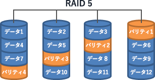

# [令和4年春期 午前 問11](https://www.ap-siken.com/kakomon/04_haru/q11.html)

#問題 #テクノロジ #システム構成要素 #システムの構成

解説を表示解説を隠す

<strong>問11</strong>　8Tバイトの磁気ディスク装置6台を，予備ディスク(ホットスペアディスク)1台込みのRAID5構成にした場合，実効データ容量は何Tバイトになるか。

<ul class="ap-choices">
<li class="ap-choice-item ap-wrong">

ア　24

6台すべてをデータに使う計算ではありません。予備1台と<a href="用語/パリティ" class="internal-link" data-href="用語/パリティ">パリティ</a>1台分を除きます。

</li>
<li class="ap-choice-item ap-correct">

イ　32

正しい。データ保存に使えるのはディスク4台分で8T×4＝32Tバイトです。

</li>
<li class="ap-choice-item ap-wrong">

ウ　40

実効容量はディスク4台分（32Tバイト）です。

</li>
<li class="ap-choice-item ap-wrong">

エ　48

6台分すべての容量ではありません。

</li>
</ul>

<h4>解説</h4>

<a href="用語/RAID5" class="internal-link" data-href="用語/RAID5">RAID5</a>は、データ本体とともに<a href="用語/パリティ" class="internal-link" data-href="用語/パリティ">パリティ</a>という誤り訂正符号を複数のディスクに<a href="用語/分散" class="internal-link" data-href="用語/分散">分散</a>して書き込む方式で、耐<a href="用語/障害" class="internal-link" data-href="用語/障害">障害</a>性、アクセスの高速化、大容量化のすべてを実現することができます。

RAIDにおける予備ディスク(ホットスペアディスク)とは、<a href="用語/故障" class="internal-link" data-href="用語/故障">故障</a>したディスクの代替として使用するために用意しておくディスクです。あらかじめ通電状態で待機させておき、他のディスクに<a href="用語/故障" class="internal-link" data-href="用語/故障">故障</a>が発生したときには、<a href="用語/故障" class="internal-link" data-href="用語/故障">故障</a>したディスクを切り離して予備ディスクに<a href="用語/故障" class="internal-link" data-href="用語/故障">故障</a>したディスクのデータを復元し<a href="用語/障害" class="internal-link" data-href="用語/障害">障害</a>発生前の状態に<a href="用語/復旧" class="internal-link" data-href="用語/復旧">復旧</a>します。この問題では6台のうち1台を予備とするのでRAIDは5台で構成することになります。

<a href="用語/パリティ" class="internal-link" data-href="用語/パリティ">パリティ</a>の容量ですが、RAIDを構成するディスク台数に関係なく<a href="用語/パリティ" class="internal-link" data-href="用語/パリティ">パリティ</a>の保存には常にディスク1台分の容量を要すると決まっているので、データの保存に使える実効容量はディスク4台分、すなわち「8Tバイト×4台＝32Tバイト」となります。したがって正解は「イ」になります。

