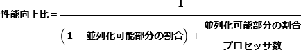

# [令和4年春期 午前 問12](https://www.ap-siken.com/kakomon/04_haru/q12.html)

#問題 #テクノロジ #システム構成要素 #システムの構成

解説を表示解説を隠す

<strong>問12</strong>　プロセッサ数と，計算処理におけるプロセスの並列化が可能な部分の割合とが，性能向上へ及ぼす影響に関する記述のうち，アムダールの法則に基づいたものはどれか。

<ul class="ap-choices">
<li class="ap-choice-item ap-wrong">

ア　全ての計算処理が並列化できる場合，速度向上比は，プロセッサ数を増やしてもある水準に漸近的に近づく。

すべて並列化できる場合は高速化を妨げる要因がなく，速度向上比はプロセッサ数に比例して増加します。

</li>
<li class="ap-choice-item ap-wrong">

イ　並列化できない計算処理がある場合，速度向上比は，プロセッサ数に比例して増加する。

並列化できない部分はプロセッサを増やしても速くならず，速度向上比は漸近的に頭打ちになります。

</li>
<li class="ap-choice-item ap-correct">

ウ　並列化できない計算処理がある場合，速度向上比は，プロセッサ数を増やしてもある水準に漸近的に近づく。

正しい。並列化できない部分がある場合の結論で，<a href="用語/アムダールの法則" class="internal-link" data-href="用語/アムダールの法則">アムダールの法則</a>から導かれます。

</li>
<li class="ap-choice-item ap-wrong">

エ　並列化できる計算処理の割合が増えると，速度向上比は，プロセッサ数に反比例して減少する。

並列化可能な割合が増えると，同じプロセッサ数でも速度向上比は高まります。

</li>
</ul>

<h4>解説</h4>

<a href="用語/アムダールの法則" class="internal-link" data-href="用語/アムダールの法則">アムダールの法則</a>は、計算処理中の並列可能な部分の割合が、プロセッサを増やしたときの<a href="用語/性能" class="internal-link" data-href="用語/性能">性能</a>向上比にどのように影響するかの関係を示した法則です。<a href="用語/性能" class="internal-link" data-href="用語/性能">性能</a>向上比、並列可能な部分の割合、プロセッサ増加数は関連があります。元ページでは図で示されています。

並列化できない部分がある場合、どれだけプロセッサ数を増やしても速度向上比は一定値で頭打ちになります。したがって「ウ」が正解です。

