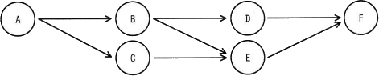
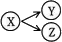
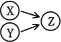
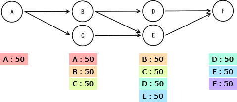

# [令和4年春期 午前 問16](https://www.ap-siken.com/kakomon/04_haru/q16.html)

#問題 #テクノロジ #ソフトウェア #オペレーティングシステム

解説を表示解説を隠す

<strong>問16</strong>　ジョブ群と実行の条件が次のとおりであるとき，一時ファイルを作成する磁気ディスクに必要な容量は最低何Mバイトか。  〔ジョブ群〕  〔実行の条件〕 (1) ジョブの実行多重度を2とする。 (2) 各ジョブの処理時間は同一であり，他のジョブの影響は受けない。 (3) 各ジョブは開始時に50Mバイトの一時ファイルを新たに作成する。 (4) の関係があれば，ジョブXの開始時に作成した一時ファイルは，直後のジョブYで参照し，ジョブYの終了時にその一時ファイルを削除する。直後のジョブが複数個ある場合には，最初に生起されるジョブだけが先行ジョブの一時ファイルを参照する。 (5) はジョブXの終了時に，ジョブY，ZのようにジョブXと矢印で結ばれる全てのジョブが，上から記述された順に優先して生起されることを示す。 (6) は先行するジョブX，Y両方が終了したときにジョブZが生起されることを示す。 (7) ジョブの生起とは実行待ち行列への追加を意味し，各ジョブは待ち行列の順に実行される。 (8) OSのオーバーヘッドは考慮しない。

<ul class="ap-choices">
<li class="ap-choice-item ap-wrong">

ア　100

同時存在する一時<a href="用語/ファイル" class="internal-link" data-href="用語/ファイル">ファイル</a>数の最大を過小評価した誤りです。

</li>
<li class="ap-choice-item ap-wrong">

イ　150

削除タイミングや参照関係の追跡を誤った誤りです。

</li>
<li class="ap-choice-item ap-correct">

ウ　200

正しい。最大4<a href="用語/ファイル" class="internal-link" data-href="用語/ファイル">ファイル</a>×50Mバイト＝200Mバイトが必要です。

</li>
<li class="ap-choice-item ap-wrong">

エ　250

同時存在<a href="用語/ファイル" class="internal-link" data-href="用語/ファイル">ファイル</a>数を過大に見積もった誤りです。

</li>
</ul>

<h4>解説</h4>

一時<a href="用語/ファイル" class="internal-link" data-href="用語/ファイル">ファイル</a>はジョブの開始時に作成され、直後のジョブが終了した時点で削除されます。問題文の条件に従ってジョブの実行状況を追跡すると次のようになります。

(1) ジョブAが生起し、実行開始される。→50Mバイトの一時<a href="用語/ファイル" class="internal-link" data-href="用語/ファイル">ファイル</a>を作成

(2) ジョブAが終了する。一時<a href="用語/ファイル" class="internal-link" data-href="用語/ファイル">ファイル</a>は直後のジョブが参照するため削除しない。

(3) ジョブB、ジョブCの順に生起する。多重度は2なのでどちらも実行開始される。条件(4)より、ジョブAの一時<a href="用語/ファイル" class="internal-link" data-href="用語/ファイル">ファイル</a>は先に生起するジョブBだけが参照する（ジョブCは参照しない）。→「50×2＝100Mバイト」の一時<a href="用語/ファイル" class="internal-link" data-href="用語/ファイル">ファイル</a>を作成

(4) ジョブB、ジョブCが終了する。ジョブAの一時<a href="用語/ファイル" class="internal-link" data-href="用語/ファイル">ファイル</a>が削除される。

(5) ジョブD、ジョブEの順に生起する。多重度は2なのでどちらも実行開始される。ジョブBの一時<a href="用語/ファイル" class="internal-link" data-href="用語/ファイル">ファイル</a>は、先に生起するジョブDだけが参照する（ジョブEは参照しない）。→「50×2で100Mバイト」の一時<a href="用語/ファイル" class="internal-link" data-href="用語/ファイル">ファイル</a>を作成

(6) ジョブD、ジョブEが終了する。ジョブB、ジョブCの一時<a href="用語/ファイル" class="internal-link" data-href="用語/ファイル">ファイル</a>が削除される。

(7) ジョブFが生起し、実行開始される。→50Mバイトの一時<a href="用語/ファイル" class="internal-link" data-href="用語/ファイル">ファイル</a>を作成

(8) ジョブFが終了する。ジョブD、ジョブEの一時<a href="用語/ファイル" class="internal-link" data-href="用語/ファイル">ファイル</a>が削除される。後続のジョブがないためジョブFの一時<a href="用語/ファイル" class="internal-link" data-href="用語/ファイル">ファイル</a>も削除される。

一時<a href="用語/ファイル" class="internal-link" data-href="用語/ファイル">ファイル</a>の容量が最も多くなるのは、4つの一時<a href="用語/ファイル" class="internal-link" data-href="用語/ファイル">ファイル</a>が同時に存在するジョブD・E実行中で、その容量は200Mバイトです。したがって、一時<a href="用語/ファイル" class="internal-link" data-href="用語/ファイル">ファイル</a>を作成する磁気ディスクには少なくとも「200Mバイト」の容量が必要です。

