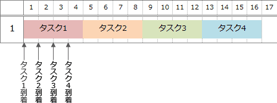
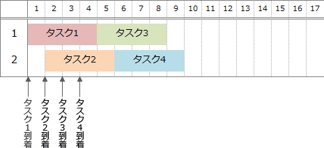

# [令和4年春期 午前 問19](https://www.ap-siken.com/kakomon/04_haru/q19.html)

#問題 #テクノロジ #ソフトウェア #オペレーティングシステム

解説を表示解説を隠す

<strong>問19</strong>　複数のクライアントから接続されるサーバがある。このサーバのタスクの多重度が2以下の場合，タスク処理時間は常に4秒である。このサーバに1秒間隔で4件の処理要求が到着した場合，全ての処理が終わるまでの時間はタスクの多重度が1のときと2のときとで，何秒の差があるか。

<ul class="ap-choices">
<li class="ap-choice-item ap-wrong">

ア　6

多重度1と2の完了時間の差は7秒です。

</li>
<li class="ap-choice-item ap-correct">

イ　7

正しい。16秒－9秒＝7秒の差になります。

</li>
<li class="ap-choice-item ap-wrong">

ウ　8

差は7秒です。

</li>
<li class="ap-choice-item ap-wrong">

エ　9

9秒は多重度2のときの完了時間です。差は7秒です。

</li>
</ul>

<h4>解説</h4>

<a href="用語/タスク" class="internal-link" data-href="用語/タスク">タスク</a>の多重度が1のときには、処理時間4秒の<a href="用語/タスク" class="internal-link" data-href="用語/タスク">タスク</a>を1つずつ処理していくので全件が完了するには「4秒×4＝16秒」を要します。

<a href="用語/タスク" class="internal-link" data-href="用語/タスク">タスク</a>の多重度が2になると、2つの<a href="用語/タスク" class="internal-link" data-href="用語/タスク">タスク</a>を並行して処理することができるので、9秒ですべての処理を完了することができます。元ページでは図で示されています。

したがって多重度が1のときと2のときの差は「16秒－9秒＝7秒」になります。正解は「イ」です。

