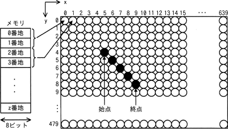

# [令和4年春期 午前 問21](https://www.ap-siken.com/kakomon/04_haru/q21.html)

#問題 #テクノロジ #ハードウェア

解説を表示解説を隠す

<strong>問21</strong>　次の方式で画素にメモリを割り当てる640×480のグラフィックLCDモジュールがある。始点(5，4)から終点(9，8)まで直線を描画するとき，直線上のx＝7の画素に割り当てられたメモリのアドレスの先頭は何番地か。ここで，画素の座標は(x，y)で表すものとする。 〔方式〕メモリは0番地から昇順に使用する。1画素は16ビットとする。座標(0，0)から座標(639，479)までメモリを連続して割り当てる。各画素は，x＝0からx軸の方向にメモリを割り当てていく。x＝639の次はx＝0とし，yを1増やす。 

<ul class="ap-choices">
<li class="ap-choice-item ap-wrong">

ア　3847

画素番号をそのまま番地とみなした誤りです。1画素は16ビット（2番地）を使うため，番地は画素番号の2倍から2を引いた値になります。

</li>
<li class="ap-choice-item ap-wrong">

イ　7680

640×12など，直線上の画素位置とずれた行・列で数えた場合の値に近い誤りです。x＝7の画素は(7，6)であり，640×6＋8番目の画素です。

</li>
<li class="ap-choice-item ap-correct">

ウ　7694

正しい。3,848番目の画素に対し，(3,848－1)×2＝7,694番地が先頭アドレスです。

</li>
<li class="ap-choice-item ap-wrong">

エ　8978

画素の通し番号や番地の計算でオフセットを誤った場合の値です。始点・終点から直線上の(7，6)を特定したうえで，640×y＋(x＋1)で画素番号を求めます。

</li>
</ul>

<h4>解説</h4>

設問の図で黒く塗りつぶされている画素のうち、x＝7の座標は(7, 6)であり、図中において8列7行目に位置します。<a href="用語/メモリ" class="internal-link" data-href="用語/メモリ">メモリ</a>には上の行の画素から順に格納されていくこと、1行には640個の画素があることを踏まえると、座標(7, 6)が格納される位置は先頭から数えて、640×縦6＋横8＝3,848番目です。図より<a href="用語/メモリ" class="internal-link" data-href="用語/メモリ">メモリ</a>の各番地のサイズ8ビット、設問より1画素は16ビットなので、1つの画素を2つの番地を使って表すことになります。格納される順番ごとに<a href="用語/メモリ" class="internal-link" data-href="用語/メモリ">メモリ</a>アドレスの先頭を考えてみると、1番目の画素は<a href="用語/メモリ" class="internal-link" data-href="用語/メモリ">メモリ</a>の0番地、2番目は2番地、3番目は4番地、…、641番目(2行目先頭画素)は1,280番地になります。これを一般化すると、n番目の画素が割り当てられる<a href="用語/メモリ" class="internal-link" data-href="用語/メモリ">メモリ</a>アドレスの先頭番地は「(n－1)×2」の式で求めることができます。以上より、座標(7, 6)＝3,848番目の画素の<a href="用語/メモリ" class="internal-link" data-href="用語/メモリ">メモリ</a>アドレスの先頭番地は、(3,848－1)×2＝7,694番地です。したがって「ウ」が正解です。

