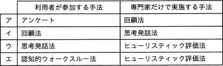
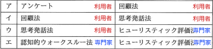

# [令和4年春期 午前 問24](https://www.ap-siken.com/kakomon/04_haru/q24.html)

#問題 #テクノロジ #ユーザーインタフェース #ユーザーインタフェース技術

解説を表示解説を隠す

<strong>問24</strong>　ユーザーインタフェースのユーザビリティを評価するときの，利用者が参加する手法と専門家だけで実施する手法の適切な組みはどれか。 

<ul class="ap-choices">
<li class="ap-choice-item ap-wrong">

ア

利用者参加の手法と専門家のみの手法の組合せが誤っています。組合せは選択肢表を参照してください。

</li>
<li class="ap-choice-item ap-wrong">

イ

利用者参加の手法と専門家のみの手法の組合せが誤っています。組合せは選択肢表を参照してください。

</li>
<li class="ap-choice-item ap-correct">

ウ

正しい。利用者が参加する手法は<a href="用語/アンケート" class="internal-link" data-href="用語/アンケート">アンケート</a>・<a href="用語/回顧法" class="internal-link" data-href="用語/回顧法">回顧法</a>・<a href="用語/思考発話法" class="internal-link" data-href="用語/思考発話法">思考発話法</a>、専門家だけで実施する手法は<a href="用語/認知的ウォークスルー" class="internal-link" data-href="用語/認知的ウォークスルー">認知的ウォークスルー</a>法・<a href="用語/ヒューリスティック評価" class="internal-link" data-href="用語/ヒューリスティック評価">ヒューリスティック評価</a>法です。

</li>
<li class="ap-choice-item ap-wrong">

エ

利用者参加の手法と専門家のみの手法の組合せが誤っています。組合せは選択肢表を参照してください。

</li>
</ul>

<h4>解説</h4>

<a href="用語/ユーザビリティ" class="internal-link" data-href="用語/ユーザビリティ">ユーザビリティ</a>に関する標準規格であるJIS Z 8521では、<a href="用語/ユーザビリティ" class="internal-link" data-href="用語/ユーザビリティ">ユーザビリティ</a>(使用性)を「ある製品が，指定された利用者によって，指定された利用の状況下で，指定された目的を達成するために用いられる際の，有効さ，効率及び利用者の満足度の度合い」と定義しています。端的にいえば<a href="用語/ユーザビリティ" class="internal-link" data-href="用語/ユーザビリティ">ユーザビリティ</a>とは「利用者にとっての使いやすさ」のことです。

それぞれの<a href="用語/ユーザビリティ" class="internal-link" data-href="用語/ユーザビリティ">ユーザビリティ</a>評価手法は次のようなものです。<a href="用語/アンケート" class="internal-link" data-href="用語/アンケート">アンケート</a>（質問紙法）は専門家が用意した質問用紙を多数の利用者に配布し、記入してもらった回答を分析することで評価する手法です。<a href="用語/回顧法" class="internal-link" data-href="用語/回顧法">回顧法</a>は被験者にタスクを実行してもらい、専門家がその行動を観察し、事後の質問への回答とともに分析する手法です。<a href="用語/思考発話法" class="internal-link" data-href="用語/思考発話法">思考発話法</a>は被験者にタスクを実行してもらい、その操作を行っている間、考えたことや感じたことを口に出してもらうことで利用者の感じ方や思考を分析する手法です。<a href="用語/認知的ウォークスルー" class="internal-link" data-href="用語/認知的ウォークスルー">認知的ウォークスルー</a>法は複数の専門家が、設計仕様書や紙のプロトタイプを見ながら、対象となるユーザーの行動をシミュレーションしていくことで問題点を明らかにしていく手法で、人の認知過程を基準にします。<a href="用語/ヒューリスティック評価" class="internal-link" data-href="用語/ヒューリスティック評価">ヒューリスティック評価</a>法は複数の専門家が、設計仕様書や紙のプロトタイプを見ながら、既知の経験則に照らし合わせて問題点を明らかにする手法で、ヒューリスティックとは「経験則」の意で、専門家の経験則を基準にします。

5つの評価手法を"利用者が参加する手法"と"専門家だけで実施する手法"に分類すると次のようになります。利用者が参加する手法は<a href="用語/アンケート" class="internal-link" data-href="用語/アンケート">アンケート</a>、<a href="用語/回顧法" class="internal-link" data-href="用語/回顧法">回顧法</a>、<a href="用語/思考発話法" class="internal-link" data-href="用語/思考発話法">思考発話法</a>です。専門家だけで実施する手法は<a href="用語/認知的ウォークスルー" class="internal-link" data-href="用語/認知的ウォークスルー">認知的ウォークスルー</a>法、<a href="用語/ヒューリスティック評価" class="internal-link" data-href="用語/ヒューリスティック評価">ヒューリスティック評価</a>法です。したがって正しい組合せは「ウ」です。

