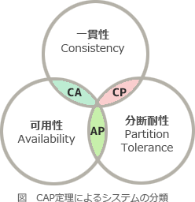

# [令和4年春期 午前 問26](https://www.ap-siken.com/kakomon/04_haru/q26.html)

#問題 #テクノロジ #データベース #データベース応用

解説を表示解説を隠す

<strong>問26</strong>　CAP定理におけるAとPの特性をもつ分散システムの説明として，適切なものはどれか。

<ul class="ap-choices">
<li class="ap-choice-item ap-wrong">

ア　可用性と整合性と分断耐性の全てを満たすことができる。

<a href="用語/CAP定理" class="internal-link" data-href="用語/CAP定理">CAP定理</a>では3特性を同時に全て満たすことはできません。

</li>
<li class="ap-choice-item ap-wrong">

イ　可用性と整合性を満たすが分断耐性を満たさない。

<a href="用語/一貫性" class="internal-link" data-href="用語/一貫性">一貫性</a>と<a href="用語/可用性" class="internal-link" data-href="用語/可用性">可用性</a>を保証すると単一のデータベースとなり分断耐性がありません。AとCの組合せです。

</li>
<li class="ap-choice-item ap-correct">

ウ　可用性と分断耐性を満たすが整合性を満たさない。

正しい。<a href="用語/CAP定理" class="internal-link" data-href="用語/CAP定理">CAP定理</a>においてAは<a href="用語/可用性" class="internal-link" data-href="用語/可用性">可用性</a>、Pは分断耐性を示します。

</li>
<li class="ap-choice-item ap-wrong">

エ　整合性と分断耐性を満たすが可用性を満たさない。

<a href="用語/一貫性" class="internal-link" data-href="用語/一貫性">一貫性</a>と分断耐性を保証するとロックが必要となり<a href="用語/可用性" class="internal-link" data-href="用語/可用性">可用性</a>が損なわれます。CとPの組合せです。

</li>
</ul>

<h4>解説</h4>

<a href="用語/CAP定理" class="internal-link" data-href="用語/CAP定理">CAP定理</a>は、分散処理システムにおいては、<a href="用語/一貫性" class="internal-link" data-href="用語/一貫性">一貫性</a>・<a href="用語/可用性" class="internal-link" data-href="用語/可用性">可用性</a>・分断耐性の3つの特性のうち、最大でも同時に2つまでしか満たすことができないとする定理です。本問の"整合性"は<a href="用語/一貫性" class="internal-link" data-href="用語/一貫性">一貫性</a>と同じ意味と考えてください。<a href="用語/一貫性" class="internal-link" data-href="用語/一貫性">一貫性</a>（Consistency）はデータの整合性が常に保たれていることです。<a href="用語/可用性" class="internal-link" data-href="用語/可用性">可用性</a>（Availability）は利用したいときに求める分だけ利用できることです。分断耐性（Partition Tolerance）はデータを複数のサーバに分散して保管していることです。<a href="用語/一貫性" class="internal-link" data-href="用語/一貫性">一貫性</a>と<a href="用語/可用性" class="internal-link" data-href="用語/可用性">可用性</a>を保証しようとすると必然的に単一のデータベースとなり、分断耐性がありません。また、<a href="用語/一貫性" class="internal-link" data-href="用語/一貫性">一貫性</a>と分断耐性を保証しようとすると、データベースの2相ロックや3相ロックが必要となり<a href="用語/可用性" class="internal-link" data-href="用語/可用性">可用性</a>が損なわれます（ロック中は利用できない）。そして、<a href="用語/可用性" class="internal-link" data-href="用語/可用性">可用性</a>と分断耐性を保証するシステムでは、ロックを掛けないので<a href="用語/一貫性" class="internal-link" data-href="用語/一貫性">一貫性</a>が損なわれます。<a href="用語/CAP定理" class="internal-link" data-href="用語/CAP定理">CAP定理</a>において、Aは<a href="用語/可用性" class="internal-link" data-href="用語/可用性">可用性</a>、Pは分断耐性を示すので、「ウ」が適切な説明です。

