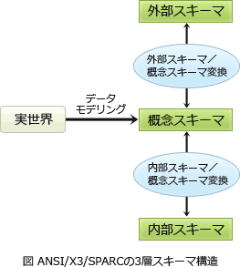

# [令和4年春期 午前 問27](https://www.ap-siken.com/kakomon/04_haru/q27.html)

#問題 #テクノロジ #データベース #データベース方式

解説を表示解説を隠す

<strong>問27</strong>　ANSI/SPARC 3層スキーマモデルにおける内部スキーマの設計に含まれるものはどれか。

<ul class="ap-choices">
<li class="ap-choice-item ap-correct">

ア　SQL問合せ応答時間の向上を目的としたインデックスの定義

正しい。<a href="用語/インデックス" class="internal-link" data-href="用語/インデックス">インデックス</a>の定義は<a href="用語/内部スキーマ" class="internal-link" data-href="用語/内部スキーマ">内部スキーマ</a>設計に含まれます。

</li>
<li class="ap-choice-item ap-wrong">

イ　エンティティ間の"1対多"，"多対多"などの関連を明示するE-Rモデルの作成

<a href="用語/E-R図" class="internal-link" data-href="用語/E-R図">E-R図</a>の作成は<a href="用語/概念スキーマ" class="internal-link" data-href="用語/概念スキーマ">概念スキーマ</a>設計に含まれます。

</li>
<li class="ap-choice-item ap-wrong">

ウ　エンティティ内やエンティティ間の整合性を保つための一意性制約や参照制約の設定

制約の設定は<a href="用語/概念スキーマ" class="internal-link" data-href="用語/概念スキーマ">概念スキーマ</a>設計に含まれます。

</li>
<li class="ap-choice-item ap-wrong">

エ　データの冗長性を排除し，更新の一貫性と効率性を保持するための正規化

表の<a href="用語/正規化" class="internal-link" data-href="用語/正規化">正規化</a>は<a href="用語/概念スキーマ" class="internal-link" data-href="用語/概念スキーマ">概念スキーマ</a>設計に含まれます。

</li>
</ul>

<h4>解説</h4>

ANSI/SPARC 3層スキーマは、<a href="用語/概念スキーマ" class="internal-link" data-href="用語/概念スキーマ">概念スキーマ</a>、<a href="用語/外部スキーマ" class="internal-link" data-href="用語/外部スキーマ">外部スキーマ</a>、<a href="用語/内部スキーマ" class="internal-link" data-href="用語/内部スキーマ">内部スキーマ</a>の3つのグループに分けてデータ定義を行うデータベースモデルで、物理的・論理的データの独立性を達成するために<a href="用語/DBMS" class="internal-link" data-href="用語/DBMS">DBMS</a>がサポートすべきアーキテクチャとして提案されたものです。<a href="用語/概念スキーマ" class="internal-link" data-href="用語/概念スキーマ">概念スキーマ</a>はデータベース化対象の業務とデータの内容を論理的なデータモデルとして表現したものです。<a href="用語/概念スキーマ" class="internal-link" data-href="用語/概念スキーマ">概念スキーマ</a>を記述するために記号系にはリレーショナルモデルの他にも、ネットワークモデル、階層型モデルなどがあります。リレーショナルモデルでは<a href="用語/E-R図" class="internal-link" data-href="用語/E-R図">E-R図</a>の作成、表定義、表の<a href="用語/正規化" class="internal-link" data-href="用語/正規化">正規化</a>が<a href="用語/概念スキーマ" class="internal-link" data-href="用語/概念スキーマ">概念スキーマ</a>に相当します。<a href="用語/外部スキーマ" class="internal-link" data-href="用語/外部スキーマ">外部スキーマ</a>は<a href="用語/概念スキーマ" class="internal-link" data-href="用語/概念スキーマ">概念スキーマ</a>で定義されたデータモデル上に利用者ごとの目的に応じた見方を表現したものです。リレーショナルモデルのビューやネットワークモデルのサブスキーマが<a href="用語/外部スキーマ" class="internal-link" data-href="用語/外部スキーマ">外部スキーマ</a>に相当します。<a href="用語/内部スキーマ" class="internal-link" data-href="用語/内部スキーマ">内部スキーマ</a>は<a href="用語/概念スキーマ" class="internal-link" data-href="用語/概念スキーマ">概念スキーマ</a>で定義されたデータモデルを記憶装置上にどのような形式で格納するかを表現したものです。ファイル編成や<a href="用語/インデックス" class="internal-link" data-href="用語/インデックス">インデックス</a>の設定などが<a href="用語/内部スキーマ" class="internal-link" data-href="用語/内部スキーマ">内部スキーマ</a>に相当します。

