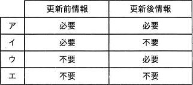
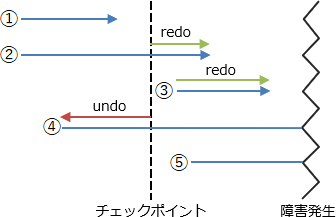

# [令和4年春期 午前 問29](https://www.ap-siken.com/kakomon/04_haru/q29.html)

#問題 #テクノロジ #データベース #トランザクション処理

解説を表示解説を隠す

<strong>問29</strong>　undo/redo方式を用いた障害回復におけるログ情報の要否として，適切な組合せはどれか。 

<ul class="ap-choices">
<li class="ap-choice-item ap-correct">

ア

正しい。更新前情報はundoで必要、更新後情報はredoで必要です。

</li>
<li class="ap-choice-item ap-wrong">

イ

ログ情報の要否の組合せが誤っています。組合せは選択肢表を参照してください。

</li>
<li class="ap-choice-item ap-wrong">

ウ

ログ情報の要否の組合せが誤っています。組合せは選択肢表を参照してください。

</li>
<li class="ap-choice-item ap-wrong">

エ

ログ情報の要否の組合せが誤っています。組合せは選択肢表を参照してください。

</li>
</ul>

<h4>解説</h4>

undo/redo方式は、<a href="用語/データベース" class="internal-link" data-href="用語/データベース">データベース</a>にシステム障害が起こったときに、更新前ログを使用した<a href="用語/ロールバック" class="internal-link" data-href="用語/ロールバック">ロールバック</a>(undo)と更新後ログを使用した<a href="用語/ロールフォワード" class="internal-link" data-href="用語/ロールフォワード">ロールフォワード</a>(redo)を組み合わせて<a href="用語/データベース" class="internal-link" data-href="用語/データベース">データベース</a>を回復する方法です。undoは行った操作の取り消し、redoは行った操作の再実行という意味です。障害発生時に進行中だった<a href="用語/トランザクション" class="internal-link" data-href="用語/トランザクション">トランザクション</a>は、一部の更新がディスクに反映されているので、<a href="用語/ロールバック" class="internal-link" data-href="用語/ロールバック">ロールバック</a>を実行して<a href="用語/トランザクション" class="internal-link" data-href="用語/トランザクション">トランザクション</a>開始前の状態に戻します（④）。<a href="用語/チェックポイント" class="internal-link" data-href="用語/チェックポイント">チェックポイント</a>後にコミットされた<a href="用語/トランザクション" class="internal-link" data-href="用語/トランザクション">トランザクション</a>は、ディスクからコミットの内容が失われているので、<a href="用語/ロールフォワード" class="internal-link" data-href="用語/ロールフォワード">ロールフォワード</a>を実行して<a href="用語/データベース" class="internal-link" data-href="用語/データベース">データベース</a>に<a href="用語/トランザクション" class="internal-link" data-href="用語/トランザクション">トランザクション</a>の処理結果を反映させます（②③）。更新前情報はundoで必要、更新後情報はredoで必要なので、正しい組合せは「ア」です。なお、コミットするまで<a href="用語/データベース" class="internal-link" data-href="用語/データベース">データベース</a>を一切更新しない遅延更新の管理機構では<a href="用語/ロールバック" class="internal-link" data-href="用語/ロールバック">ロールバック</a>が不要なので、障害回復時にredoのみを行いundoを行わない「no-undo/redo方式」が使われることもあります。

