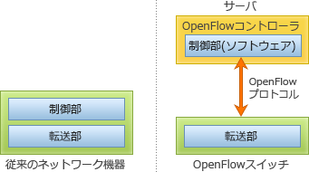

# [令和4年春期 午前 問35](https://www.ap-siken.com/kakomon/04_haru/q35.html)

#問題 #テクノロジ #ネットワーク #ネットワーク管理

解説を表示解説を隠す

<strong>問35</strong>　OpenFlowを使ったSDN(Software-Defined Networking)に関する記述として，適切なものはどれか。

<ul class="ap-choices">
<li class="ap-choice-item ap-wrong">

ア　インターネットのドメイン名を管理する世界規模の分散データベースを用いて，IPアドレスの代わりに名前を指定して通信できるようにする仕組み

これはDNS(Domain Name System)の説明です。

</li>
<li class="ap-choice-item ap-wrong">

イ　携帯電話網において，回線交換方式ではなく，パケット交換方式で音声通話を実現する方式

これはVoLTEの説明です。

</li>
<li class="ap-choice-item ap-wrong">

ウ　ストレージ装置とサーバを接続し，WWN(World Wide Name)によってノードやポートを識別するストレージ用ネットワーク

これはSAN(Storage Area Network)の説明です。

</li>
<li class="ap-choice-item ap-correct">

エ　データ転送機能とネットワーク制御機能を論理的に分離し，ネットワーク制御を集中的に行うことを可能にしたアーキテクチャ

正しい。<a href="用語/OpenFlow" class="internal-link" data-href="用語/OpenFlow">OpenFlow</a>による<a href="用語/SDN" class="internal-link" data-href="用語/SDN">SDN</a>の説明です。

</li>
</ul>

<h4>解説</h4>

<a href="用語/SDN" class="internal-link" data-href="用語/SDN">SDN</a>(Software-Defined Networking)は、ソフトウェア制御によって物理的なネットワーク構成にとらわれない動的で柔軟なネットワークを実現する技術全般を意味します。<a href="用語/SDN" class="internal-link" data-href="用語/SDN">SDN</a>を実現するための技術標準が<a href="用語/OpenFlow" class="internal-link" data-href="用語/OpenFlow">OpenFlow</a>プロトコルであり、既存のネットワーク機器がもつ制御処理(コントロールプレーン)と転送処理(データプレーン)を分離することで、<a href="用語/OpenFlow" class="internal-link" data-href="用語/OpenFlow">OpenFlow</a>コントローラーが中央集権的に複数のスイッチの転送制御を管理します。<a href="用語/OpenFlow" class="internal-link" data-href="用語/OpenFlow">OpenFlow</a>ではパケットやフレームをフローとして扱い、フローの様々な情報を使って柔軟に転送制御できるようになっています。スイッチは<a href="用語/OpenFlow" class="internal-link" data-href="用語/OpenFlow">OpenFlow</a>コントローラーと通信を行いながら、<a href="用語/OpenFlow" class="internal-link" data-href="用語/OpenFlow">OpenFlow</a>コントローラーから提供されるフローテーブルや直接の転送指示により転送先を判断します。したがって「エ」が正解です。

