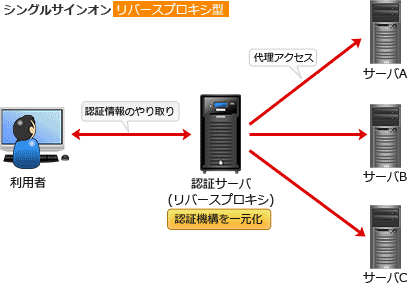

# [令和4年春期 午前 問41](https://www.ap-siken.com/kakomon/04_haru/q41.html)

#問題 #テクノロジ #セキュリティ #情報セキュリティ

解説を表示解説を隠す

<strong>問41</strong>　クライアント証明書で利用者を認証するリバースプロキシサーバを用いて，複数のWebサーバにシングルサインオンを行うシステムがある。このシステムに関する記述のうち，適切なものはどれか。

<ul class="ap-choices">
<li class="ap-choice-item ap-wrong">

ア　クライアント証明書を利用者のPCに送信するのは，Webサーバではなく，リバースプロキシサーバである。

<a href="用語/クライアント証明書" class="internal-link" data-href="用語/クライアント証明書">クライアント証明書</a>は利用者の認証に使うので、利用者のPCから<a href="用語/リバースプロキシサーバ" class="internal-link" data-href="用語/リバースプロキシサーバ">リバースプロキシサーバ</a>に送信されます。

</li>
<li class="ap-choice-item ap-wrong">

イ　クライアント証明書を利用者のPCに送信するのは，リバースプロキシサーバではなく，Webサーバである。

<a href="用語/クライアント証明書" class="internal-link" data-href="用語/クライアント証明書">クライアント証明書</a>は、PCから<a href="用語/リバースプロキシサーバ" class="internal-link" data-href="用語/リバースプロキシサーバ">リバースプロキシサーバ</a>に送信されます。

</li>
<li class="ap-choice-item ap-wrong">

ウ　利用者IDなどの情報をWebサーバに送信するのは，リバースプロキシサーバではなく，利用者のPCである。

利用者のPCと<a href="用語/Webサーバ" class="internal-link" data-href="用語/Webサーバ">Webサーバ</a>が直接通信することはありません。

</li>
<li class="ap-choice-item ap-correct">

エ　利用者IDなどの情報をWebサーバに送信するのは，利用者のPCではなく，リバースプロキシサーバである。

正しい。利用者が<a href="用語/リバースプロキシサーバ" class="internal-link" data-href="用語/リバースプロキシサーバ">リバースプロキシサーバ</a>で認証を受けた場合、<a href="用語/リバースプロキシサーバ" class="internal-link" data-href="用語/リバースプロキシサーバ">リバースプロキシサーバ</a>から<a href="用語/Webサーバ" class="internal-link" data-href="用語/Webサーバ">Webサーバ</a>へ利用者IDなどの情報が送信されます。

</li>
</ul>

<h4>解説</h4>

<a href="用語/リバースプロキシ" class="internal-link" data-href="用語/リバースプロキシ">リバースプロキシ</a>型SSOは、複数の<a href="用語/Webサーバ" class="internal-link" data-href="用語/Webサーバ">Webサーバ</a>と利用者PCとの間に<a href="用語/リバースプロキシサーバ" class="internal-link" data-href="用語/リバースプロキシサーバ">リバースプロキシサーバ</a>を配置し、すべての<a href="用語/Webサーバ" class="internal-link" data-href="用語/Webサーバ">Webサーバ</a>へのアクセスを<a href="用語/リバースプロキシサーバ" class="internal-link" data-href="用語/リバースプロキシサーバ">リバースプロキシサーバ</a>に集約することで<a href="用語/シングルサインオン" class="internal-link" data-href="用語/シングルサインオン">シングルサインオン</a>を実現する構成です。<a href="用語/リバースプロキシサーバ" class="internal-link" data-href="用語/リバースプロキシサーバ">リバースプロキシサーバ</a>はアクセスしてきた利用者を認証し、認証に成功すれば<a href="用語/リバースプロキシサーバ" class="internal-link" data-href="用語/リバースプロキシサーバ">リバースプロキシサーバ</a>は<a href="用語/Webサーバ" class="internal-link" data-href="用語/Webサーバ">Webサーバ</a>に代理アクセスして、結果を利用者に返します。

