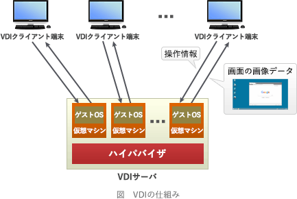

# [令和4年春期 午前 問44](https://www.ap-siken.com/kakomon/04_haru/q44.html)

#問題 #テクノロジ #セキュリティ #情報セキュリティ対策

解説を表示解説を隠す

<strong>問44</strong>　内部ネットワークのPCからインターネット上のWebサイトを参照するときに，DMZに設置したVDI(Virtual Desktop Infrastructure)サーバ上のWebブラウザを利用すると，未知のマルウェアがPCにダウンロードされるのを防ぐというセキュリティ上の効果が期待できる。この効果を生み出すVDIサーバの動作の特徴はどれか。

<ul class="ap-choices">
<li class="ap-choice-item ap-wrong">

ア　Webサイトからの受信データを受信処理した後，IPsecでカプセル化し，PCに送信する。

<a href="用語/VDI" class="internal-link" data-href="用語/VDI">VDI</a>は受信データを画面画像として転送する仕組みであり、<a href="用語/IPsec" class="internal-link" data-href="用語/IPsec">IPsec</a>でカプセル化してPCに送る動作ではない。

</li>
<li class="ap-choice-item ap-wrong">

イ　Webサイトからの受信データを受信処理した後，実行ファイルを削除し，その他のデータをPCに送信する。

実行ファイルを削除して他のデータを送る方式ではなく、デスクトップ画面の画像データだけをPCに送信する。

</li>
<li class="ap-choice-item ap-correct">

ウ　Webサイトからの受信データを受信処理した後，生成したデスクトップ画面の画像データだけをPCに送信する。

正しい。<a href="用語/VDI" class="internal-link" data-href="用語/VDI">VDI</a>サーバからPCへ送るのは操作結果のデスクトップ画面の画像データのみである。

</li>
<li class="ap-choice-item ap-wrong">

エ　Webサイトからの受信データを受信処理した後，不正なコード列が検知されない場合だけPCに送信する。

不正なコード列の検知でフィルタする方式ではなく、クライアントPCとインターネットの直接通信を行わないことが特徴である。

</li>
</ul>

<h4>解説</h4>

<a href="用語/VDI" class="internal-link" data-href="用語/VDI">VDI</a>(Virtual Desktop Infrastructure)は、サーバ内にクライアントごとの仮想マシンを用意して仮想デスクトップ環境を構築する技術です。利用者はネットワークを通じて<a href="用語/VDI" class="internal-link" data-href="用語/VDI">VDI</a>サーバ上の仮想デスクトップ環境に接続し、クライアントPCには<a href="用語/VDI" class="internal-link" data-href="用語/VDI">VDI</a>サーバからの操作結果画面のみが転送される仕組みになっています。

この仕組みにより、クライアントがインターネット上のサイトと直接的な通信を行わなくなるので、クライアントPCをインターネットから分離できます。もし利用者の操作により不正なマルウェアをダウンロードしてしまったとしても、それが保存されるのは<a href="用語/VDI" class="internal-link" data-href="用語/VDI">VDI</a>サーバ上の<a href="用語/仮想環境" class="internal-link" data-href="用語/仮想環境">仮想環境</a>ですので、クライアントPCへの感染を防げます。汚染された<a href="用語/仮想環境" class="internal-link" data-href="用語/仮想環境">仮想環境</a>を削除してしまえば内部ネットワークへの影響もありません。

<a href="用語/VDI" class="internal-link" data-href="用語/VDI">VDI</a>サーバからPCに送信されるのは「デスクトップ画面の画像データ」のみです。したがって正解は「ウ」です。

