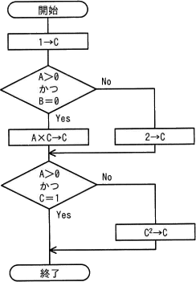
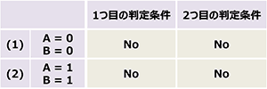
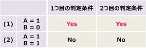
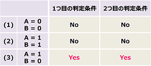
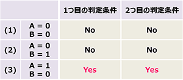

# [令和4年春期 午前 問47](https://www.ap-siken.com/kakomon/04_haru/q47.html)

#問題 #テクノロジ #システム開発技術 #実装・構築

解説を表示解説を隠す

<strong>問47</strong>　次の流れ図において，判定条件網羅(分岐網羅)を満たす最少のテストケースはどれか。 

<ul class="ap-choices">
<li class="ap-choice-item ap-wrong">

ア　(1) A＝0，B＝0　(2) A＝1，B＝1

(1)は1つ目の分岐でA＝0・B＝0なのでNo、2つ目の分岐もA＝0・C＝2なのでNo。(2)は1つ目の分岐でA＝1・B＝1なのでNo、2つ目の分岐もA＝1・C＝2なのでNo。どちらの判定条件もYesに分岐しない。 

</li>
<li class="ap-choice-item ap-correct">

イ　(1) A＝1，B＝0　(2) A＝1，B＝1

正しい。(1)は1つ目の分岐でA＝1・B＝0なのでYes、2つ目の分岐もA＝1・C＝1なのでYes。(2)は1つ目の分岐でA＝1・B＝1なのでNo、2つ目の分岐もA＝1・C＝2なのでNo。分岐網羅を満たし、無駄がない最少の<a href="用語/テストケース" class="internal-link" data-href="用語/テストケース">テストケース</a>。 

</li>
<li class="ap-choice-item ap-wrong">

ウ　(1) A＝0，B＝0　(2) A＝1，B＝1　(3) A＝1，B＝0

分岐網羅は満たすが、(1)と(2)はどちらも両分岐がNoで冗長。どちらか1つで足りるため最少ではない。 

</li>
<li class="ap-choice-item ap-wrong">

エ　(1) A＝0，B＝0　(2) A＝0，B＝1　(3) A＝1，B＝0

分岐網羅は満たすが、(1)と(2)はどちらも両分岐がNoで冗長。どちらか1つで足りるため最少ではない。 

</li>
</ul>

<h4>解説</h4>

<a href="用語/ホワイトボックステスト" class="internal-link" data-href="用語/ホワイトボックステスト">ホワイトボックステスト</a>における網羅性のレベルである「<a href="用語/判定条件網羅" class="internal-link" data-href="用語/判定条件網羅">判定条件網羅</a>」とは、プログラム中の分岐の判定条件において、結果が真となる場合、偽となる場合を少なくとも1回は実行するように<a href="用語/テストケース" class="internal-link" data-href="用語/テストケース">テストケース</a>を設計することです。なお、網羅性のレベルには<a href="用語/判定条件網羅" class="internal-link" data-href="用語/判定条件網羅">判定条件網羅</a>の他にも次のようなものがあります。

<ul>
<li><a href="用語/命令網羅" class="internal-link" data-href="用語/命令網羅">命令網羅</a>（網羅性:低い↑）… すべての命令を少なくとも1回は実行する<a href="用語/テストケース" class="internal-link" data-href="用語/テストケース">テストケース</a>を設計する</li>
<li>分岐網羅（<a href="用語/判定条件網羅" class="internal-link" data-href="用語/判定条件網羅">判定条件網羅</a>）… 判定条件の真偽を少なくとも1回は実行する<a href="用語/テストケース" class="internal-link" data-href="用語/テストケース">テストケース</a>を設計する</li>
<li><a href="用語/条件網羅" class="internal-link" data-href="用語/条件網羅">条件網羅</a> … 判定条件が複数ある場合に、それぞれの条件が真・偽の場合を組み合わせた<a href="用語/テストケース" class="internal-link" data-href="用語/テストケース">テストケース</a>を設計する</li>
<li>判定条件・<a href="用語/条件網羅" class="internal-link" data-href="用語/条件網羅">条件網羅</a> … <a href="用語/判定条件網羅" class="internal-link" data-href="用語/判定条件網羅">判定条件網羅</a>と<a href="用語/条件網羅" class="internal-link" data-href="用語/条件網羅">条件網羅</a>を組み合わせて<a href="用語/テストケース" class="internal-link" data-href="用語/テストケース">テストケース</a>を設計する</li>
<li><a href="用語/複数条件網羅" class="internal-link" data-href="用語/複数条件網羅">複数条件網羅</a>（網羅性:高↓）… 判定条件のすべての可能な結果の組合せを網羅し、かつ、すべての命令を少なくとも1回は実行するように<a href="用語/テストケース" class="internal-link" data-href="用語/テストケース">テストケース</a>を作成する</li>
</ul>

