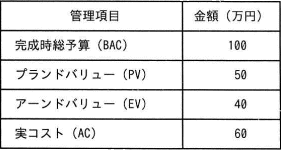

# [令和4年春期 午前 問51](https://www.ap-siken.com/kakomon/04_haru/q51.html)

#問題 #マネジメント #プロジェクトマネジメント #プロジェクトの時間

解説を表示解説を隠す

<strong>問51</strong>　ある組織では，プロジェクトのスケジュールとコストの管理にアーンドバリューマネジメントを用いている。期間10日間のプロジェクトの，5日目の終了時点の状況は表のとおりである。この時点でのコスト効率が今後も続くとしたとき，完成時総コスト見積り(EAC)は何万円か。 

<ul class="ap-choices">
<li class="ap-choice-item ap-wrong">

ア　110

<a href="用語/CPI" class="internal-link" data-href="用語/CPI">CPI</a>＝EV÷AC＝2/3とBAC÷<a href="用語/CPI" class="internal-link" data-href="用語/CPI">CPI</a>で求める完成時総コスト見積り150万円とは一致しません。

</li>
<li class="ap-choice-item ap-wrong">

イ　120

残作業のコスト見積り(<a href="用語/ETC" class="internal-link" data-href="用語/ETC">ETC</a>)を(BAC－EV)÷<a href="用語/CPI" class="internal-link" data-href="用語/CPI">CPI</a>で求めず，(BAC－EV)をそのままACに足した誤答です（60＋60＝120）。

</li>
<li class="ap-choice-item ap-wrong">

ウ　135

<a href="用語/CPI" class="internal-link" data-href="用語/CPI">CPI</a>＝EV÷AC＝2/3とBAC÷<a href="用語/CPI" class="internal-link" data-href="用語/CPI">CPI</a>で求める完成時総コスト見積り150万円とは一致しません。

</li>
<li class="ap-choice-item ap-correct">

エ　150

正しい。<a href="用語/CPI" class="internal-link" data-href="用語/CPI">CPI</a>＝EV÷AC＝2/3より，EAC＝BAC÷<a href="用語/CPI" class="internal-link" data-href="用語/CPI">CPI</a>＝150万円。

</li>
</ul>

<h4>解説</h4>

アーンドバリューマネジメント(<a href="用語/EVM" class="internal-link" data-href="用語/EVM">EVM</a>:Earned Value Management)は、プロジェクトにおける作業を金銭の価値に置き換えて定量的に実績管理をする<a href="用語/進捗管理" class="internal-link" data-href="用語/進捗管理">進捗管理</a>手法で、PV、EV、ACという3つの指標を用いることが特徴です。PV（Planned Value）プロジェクト開始当初、現時点までに計画されていた作業に対する予算。EV（Earned Value）現時点までに完了した作業に割り当てられていた予算。AC（Actual Cost）現時点までに完了した作業に対して実際に投入した総コスト。各指標を比較して、EV－ACがマイナス値であれば完了済み作業に対する予算よりも投入コストが多いのでコスト超過、EV－PVがマイナス値であれば完了済み作業に対する予算が当初の予算よりも少ないので進捗遅れ、と判断することができます。

完成時総コスト見積り(EAC:Estimate At Completion)は、完了済作業に要した総コスト(AC)に残作業に要するコスト(<a href="用語/ETC" class="internal-link" data-href="用語/ETC">ETC</a>:Estimate To Complete)を足した、プロジェクト終了時の総コストの予測値です。設問の事例では、5日目終了時点で、EV(完了済み作業に対する予算)40万円の作業に対してAC(実コスト)60万円となっていて、プロジェクト予算の1.5倍の実コストが発生しています。このため現状のコスト効率が完成時まで続くならば、完成時総コスト見積り(EAC)は表にある完成時総予算100万円の1.5倍である150万円になると見込めます。よって「エ」が正解です。

なお、<a href="用語/EVM" class="internal-link" data-href="用語/EVM">EVM</a>には完成時総コスト見積り(EAC)を求める公式があるため、厳密にはこれに従って計算します。完成時総コスト見積り(EAC)＝AC＋<a href="用語/ETC" class="internal-link" data-href="用語/ETC">ETC</a>。残作業のコスト見積り(<a href="用語/ETC" class="internal-link" data-href="用語/ETC">ETC</a>)＝(BAC－EV)÷<a href="用語/CPI" class="internal-link" data-href="用語/CPI">CPI</a>。コスト効率指数(<a href="用語/CPI" class="internal-link" data-href="用語/CPI">CPI</a>)＝EV÷AC。設問では、BAC＝100万円、EV＝40万円、AC＝60万円なので、BAC＝100万円、<a href="用語/CPI" class="internal-link" data-href="用語/CPI">CPI</a>＝EV÷AC＝40÷60＝2／3、<a href="用語/ETC" class="internal-link" data-href="用語/ETC">ETC</a>＝(100－40)÷2／3＝90万円、EAC＝60＋90＝150万円。また、この設問の事例のように現時点までのコスト効率がプロジェクト終了まで続くのであれば、「EAC＝BAC÷<a href="用語/CPI" class="internal-link" data-href="用語/CPI">CPI</a>」で単純に求められるので、<a href="用語/CPI" class="internal-link" data-href="用語/CPI">CPI</a>＝40÷60＝2／3、EAC＝100÷2／3＝150万円。

