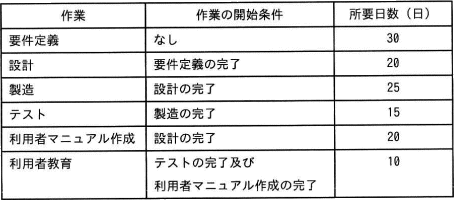
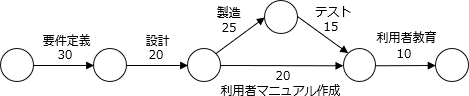

# [令和4年春期 午前 問53](https://www.ap-siken.com/kakomon/04_haru/q53.html)

#問題 #マネジメント #プロジェクトマネジメント #プロジェクトの時間

解説を表示解説を隠す

<strong>問53</strong>　ソフトウェア開発プロジェクトにおいて，表の全ての作業を完了させるために必要な期間は最短で何日間か。 

<ul class="ap-choices">
<li class="ap-choice-item ap-wrong">

ア　80

並行作業を考慮せず「要件定義→設計→利用者マニュアル作成→利用者教育」のパスだけを合計した誤答です。

</li>
<li class="ap-choice-item ap-wrong">

イ　95

製造とテストの所要日数を正しく加味できていない誤答です。

</li>
<li class="ap-choice-item ap-correct">

ウ　100

正しい。<a href="用語/クリティカルパス" class="internal-link" data-href="用語/クリティカルパス">クリティカルパス</a>上の作業日数の合計は30＋20＋25＋15＋10＝100日です。

</li>
<li class="ap-choice-item ap-wrong">

エ　120

並行して行える作業も直列に足し合わせた誤答です。

</li>
</ul>

<h4>解説</h4>

作業の先後関係に注意しながら設問の表を<a href="用語/アローダイアグラム" class="internal-link" data-href="用語/アローダイアグラム">アローダイアグラム</a>に変換すると以下のようになります。

並行作業となる部分に注目すると、利用者マニュアル作成(20日)よりも製造(25日)＋テスト(15日)の方が日数を要するので、<a href="用語/クリティカルパス" class="internal-link" data-href="用語/クリティカルパス">クリティカルパス</a>は「要件定義→設計→製造→テスト→利用者教育」、最短所要日数は「30＋20＋25＋15＋10＝100日」です。したがって「ウ」が正解となります。

