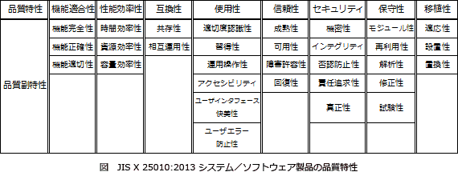

# [令和4年春期 午前 問65](https://www.ap-siken.com/kakomon/04_haru/q65.html)

#問題 #ストラテジ #システム企画 #要件定義

解説を表示解説を隠す

<strong>問65</strong>　非機能要件の使用性に該当するものはどれか。

<ul class="ap-choices">
<li class="ap-choice-item ap-correct">

ア　4時間以内のトレーニングを受けることで，新しい画面を操作できるようになること

正しい。<a href="用語/使用性" class="internal-link" data-href="用語/使用性">使用性</a>のうち習得性に該当します。

</li>
<li class="ap-choice-item ap-wrong">

イ　業務量がピークの日であっても，8時間以内で夜間バッチ処理を完了できること

<a href="用語/性能効率性" class="internal-link" data-href="用語/性能効率性">性能効率性</a>のうち時間効率性に該当します。

</li>
<li class="ap-choice-item ap-wrong">

ウ　現行のシステムから新システムに72時間以内で移行できること

<a href="用語/移植性" class="internal-link" data-href="用語/移植性">移植性</a>のうち置換性に該当します。

</li>
<li class="ap-choice-item ap-wrong">

エ　地震などの大規模災害時であっても，144時間以内にシステムを復旧できること

<a href="用語/信頼性" class="internal-link" data-href="用語/信頼性">信頼性</a>のうち回復性に該当します。

</li>
</ul>

<h4>解説</h4>

<a href="用語/使用性" class="internal-link" data-href="用語/使用性">使用性</a>(<a href="用語/ユーザビリティ" class="internal-link" data-href="用語/ユーザビリティ">ユーザビリティ</a>)とは、システムやソフトウェアが、利用者の要求に足るようにわかりやすく、使いやすく、また魅力的なものであるかの度合いです。<a href="用語/JIS X 25010" class="internal-link" data-href="用語/JIS X 25010">JIS X 25010</a>:2013では、次のように定義されています。「明示された利用状況において，<a href="用語/有効性" class="internal-link" data-href="用語/有効性">有効性</a>，効率性及び<a href="用語/満足性" class="internal-link" data-href="用語/満足性">満足性</a>をもって明示された目標を達成するために，明示された利用者が製品又はシステムを利用することができる度合い」また<a href="用語/使用性" class="internal-link" data-href="用語/使用性">使用性</a>には、適切度認識性、習得性、運用操作性、ユーザーエラー防止性、<a href="用語/ユーザーインタフェース" class="internal-link" data-href="用語/ユーザーインタフェース">ユーザーインタフェース</a>快美性、<a href="用語/アクセシビリティ" class="internal-link" data-href="用語/アクセシビリティ">アクセシビリティ</a>の7つの副特性が含まれます。選択肢のうち、利用者の使いやすさに関わる要件は「ア」だけです。

