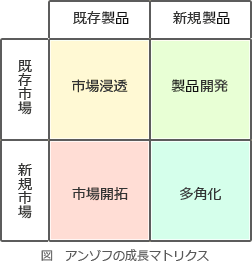

# [令和4年春期 午前 問68](https://www.ap-siken.com/kakomon/04_haru/q68.html)

#問題 #ストラテジ #経営戦略マネジメント #経営戦略手法

解説を表示解説を隠す

<strong>問68</strong>　アンゾフの成長マトリクスを説明したものはどれか。

<ul class="ap-choices">
<li class="ap-choice-item ap-wrong">

ア　外部環境と内部環境の観点から，強み，弱み，機会，脅威という四つの要因について情報を整理し，企業を取り巻く環境を分析する手法である。

これはSWOT分析の説明です。

</li>
<li class="ap-choice-item ap-wrong">

イ　企業のビジョンと戦略を実現するために，財務，顧客，内部ビジネスプロセス，学習と成長という四つの視点から事業活動を検討し，アクションプランまで具体化していくマネジメント手法である。

これはバランススコアカードの説明です。

</li>
<li class="ap-choice-item ap-correct">

ウ　事業戦略を，市場浸透，市場拡大，製品開発，多角化という四つのタイプに分類し，事業の方向性を検討する際に用いる手法である。

正しい。アンゾフの成長マトリクスの説明です。

</li>
<li class="ap-choice-item ap-wrong">

エ　製品ライフサイクルを，導入期，成長期，成熟期，衰退期という四つの段階に分類し，企業にとって最適な戦略を立案する手法である。

これは<a href="用語/プロダクトライフサイクル" class="internal-link" data-href="用語/プロダクトライフサイクル">プロダクトライフサイクル</a>の説明です。

</li>
</ul>

<h4>解説</h4>

アンゾフの成長マトリクスは、経営学者のH・イゴール・アンゾフ（H. Igor Ansoff）が提唱したもので、縦軸に「市場」、横軸に「製品」をとり、それぞれに「既存」「新規」の2区分を設け、4象限(市場浸透，製品開発，市場開拓，<a href="用語/多角化" class="internal-link" data-href="用語/多角化">多角化</a>)のマトリクスとしたものです。事業が成長・発展できる経営戦略を検討するために適した<a href="用語/フレームワーク" class="internal-link" data-href="用語/フレームワーク">フレームワーク</a>です。

