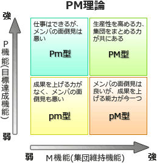

# [令和4年春期 午前 問75](https://www.ap-siken.com/kakomon/04_haru/q75.html)

#問題 #ストラテジ #企業活動 #経営・組織論

解説を表示解説を隠す

<strong>問75</strong>　リーダーシップ論のうち，PM理論の特徴はどれか。

<ul class="ap-choices">
<li class="ap-choice-item ap-wrong">

ア　優れたリーダーシップを発揮する，リーダー個人がもつ性格，知性，外観などの個人的資質の分析に焦点を当てている。

特例論的アプローチの特徴です。戦前に一般的だった主張ですが、長年の研究結果よりリーダーと非リーダーを見分けるのに有効な資質は存在しないとされています。

</li>
<li class="ap-choice-item ap-correct">

イ　リーダーシップのスタイルについて，目標達成能力と集団維持能力の二つの次元に焦点を当てている。

正しい。<a href="用語/PM理論" class="internal-link" data-href="用語/PM理論">PM理論</a>の特徴です。

</li>
<li class="ap-choice-item ap-wrong">

ウ　リーダーシップの有効性は，部下の成熟(自律性)の度合いという状況要因に依存するとしている。

<a href="用語/SL理論" class="internal-link" data-href="用語/SL理論">SL理論</a>（状況対応型<a href="用語/リーダーシップ" class="internal-link" data-href="用語/リーダーシップ">リーダーシップ</a>）の特徴です。いかなる状況にも効果的な唯一万能のリーダー行動は存在しないという主張の下、<a href="用語/リーダーシップ" class="internal-link" data-href="用語/リーダーシップ">リーダーシップ</a>の有効性を状況との関係で捉え、状況要素のうち最も重要である部下や集団（フォロワー）の能力及び意欲の水準（レディネス）ごとに、有効性が高い<a href="用語/リーダーシップ" class="internal-link" data-href="用語/リーダーシップ">リーダーシップ</a>のスタイルを示したモデルです。

</li>
<li class="ap-choice-item ap-wrong">

エ　リーダーシップの有効性は，リーダーがもつパーソナリティと，リーダーがどれだけ統制力や影響力を行使できるかという状況要因に依存するとしている。

<a href="用語/コンティンジェンシー理論" class="internal-link" data-href="用語/コンティンジェンシー理論">コンティンジェンシー理論</a>（状況呼応型<a href="用語/リーダーシップ" class="internal-link" data-href="用語/リーダーシップ">リーダーシップ</a>）の特徴です。リーダーのもつパワーおよびリーダーとメンバー間の対人関係や職位等によって決まる権力行使の幅により<a href="用語/リーダーシップ" class="internal-link" data-href="用語/リーダーシップ">リーダーシップ</a>の有効性が左右されるという考え方です。

</li>
</ul>

<h4>解説</h4>

<a href="用語/PM理論" class="internal-link" data-href="用語/PM理論">PM理論</a>(ピーエムりろん)とは、<a href="用語/リーダーシップ" class="internal-link" data-href="用語/リーダーシップ">リーダーシップ</a>は「P機能」と「M機能」という2つの柱で構成されているとする理論で、2つの機能の強弱の組合せでリーダーのタイプを類型化して表します。P機能（Performance function）… 目標達成能力計画立案、指示、叱咤などによってチームの生産性を高め、目標達成に向けてチームをけん引していく能力M機能（Maintenance function）… 集団維持能力チーム構成員同士の人間関係を良好に保ち、チームワークを深める能力各機能が強い場合を大文字(P,M)、弱い場合を小文字(p,m)で表し、その組合せで4つのタイプに当てはめます。

したがって「イ」の記述が適切です。

