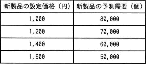

# [令和4年春期 午前 問76](https://www.ap-siken.com/kakomon/04_haru/q76.html)

#問題 #ストラテジ #企業活動 #会計・財務

解説を表示解説を隠す

<strong>問76</strong>　新製品の設定価格とその価格での予測需要との関係を表にした。最大利益が見込める新製品の設定価格はどれか。ここで，いずれの場合にも，次の費用が発生するものとする。 固定費：1,000,000円 変動費：600円／個 

<ul class="ap-choices">
<li class="ap-choice-item ap-wrong">

ア　1,000

設定価格1,000円での利益は31,000,000円であり、最大ではない。

</li>
<li class="ap-choice-item ap-wrong">

イ　1,200

設定価格1,200円での利益は41,000,000円であり、最大ではない。

</li>
<li class="ap-choice-item ap-wrong">

ウ　1,400

設定価格1,400円での利益は47,000,000円であり、最大ではない。

</li>
<li class="ap-choice-item ap-correct">

エ　1,600

正しい。設定価格1,600円での利益は49,000,000円で最大である。

</li>
</ul>

<h4>解説</h4>

利益は"売上－<a href="用語/費用" class="internal-link" data-href="用語/費用">費用</a>"で計算できます。この問題では、固定費と変動費が決められているので、利益＝価格×販売個数－固定費－変動費×販売個数の式でそれぞれの場合の利益額を計算します。よって、最も利益額が大きいのは「エ」の設定価格で販売した場合です。

