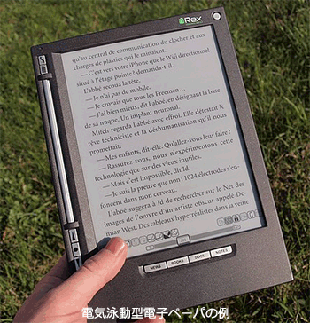

# [令和4年秋期 午前 問11](https://www.ap-siken.com/kakomon/04_aki/q11.html)

#問題 #テクノロジ #コンピュータ構成要素 #入出力装置

解説を表示解説を隠す

<strong>問11</strong>　電気泳動型電子ペーパーの説明として，適切なものはどれか。

<ul class="ap-choices">
<li class="ap-choice-item ap-wrong">

ア　デバイスに印加した電圧によって，光の透過状態を変化させて表示する。

<a href="用語/液晶ディスプレイ" class="internal-link" data-href="用語/液晶ディスプレイ">液晶ディスプレイ</a>の説明です。

</li>
<li class="ap-choice-item ap-correct">

イ　電圧を印加した電極に，着色した帯電粒子を集めて表示する。

正しい。電気泳動型<a href="用語/電子ペーパー" class="internal-link" data-href="用語/電子ペーパー">電子ペーパー</a>の説明です。

</li>
<li class="ap-choice-item ap-wrong">

ウ　電圧をかけると発光する薄膜デバイスを用いて表示する。

<a href="用語/有機ELディスプレイ" class="internal-link" data-href="用語/有機ELディスプレイ">有機ELディスプレイ</a>の説明です。

</li>
<li class="ap-choice-item ap-wrong">

エ　半導体デバイス上に作成した微小な鏡の向きを変えて，反射することによって表示する。

<a href="用語/MEMS" class="internal-link" data-href="用語/MEMS">MEMS</a>(Micro Electro Mechanical Systems)ディスプレイの説明です。

</li>
</ul>

<h4>解説</h4>

電気泳動型<a href="用語/電子ペーパー" class="internal-link" data-href="用語/電子ペーパー">電子ペーパー</a>は、<a href="用語/電子ペーパー" class="internal-link" data-href="用語/電子ペーパー">電子ペーパー</a>（ディスプレイ上に紙のように表示されるメディア）の代表的な方式で、マイクロカプセル内の白色と黒色の帯電粒子を、電圧を印加した電極により移動させて白黒の画面を表示させるものです。<a href="用語/省電力" class="internal-link" data-href="用語/省電力">省電力</a>かつ高い視認性を誇るため、Amazon Kindleなどの電子書籍リーダーや<a href="用語/デジタルサイネージ" class="internal-link" data-href="用語/デジタルサイネージ">デジタルサイネージ</a>に使われています。

