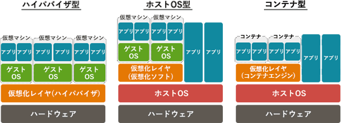

# [令和4年秋期 午前 問12](https://www.ap-siken.com/kakomon/04_aki/q12.html)

#問題 #テクノロジ #システム構成要素 #システムの構成

解説を表示解説を隠す

<strong>問12</strong>　コンテナ型仮想化の説明として，適切なものはどれか。

<ul class="ap-choices">
<li class="ap-choice-item ap-wrong">

ア　物理サーバと物理サーバの仮想環境とがOSを共有するので，物理サーバか物理サーバの仮想環境のどちらかにOSをもてばよい。

コンテナ型がOSを共有するというのは正しいが、OSは必ず物理サーバがもつことになる。

</li>
<li class="ap-choice-item ap-wrong">

イ　物理サーバにホストOSをもたず，物理サーバにインストールした仮想化ソフトウェアによって，個別のゲストOSをもった仮想サーバを動作させる。

コンテナ型はホストOSを持つ。ホストOSがない<a href="用語/アーキテクチャ" class="internal-link" data-href="用語/アーキテクチャ">アーキテクチャ</a>はハイパーバイザ型の説明。

</li>
<li class="ap-choice-item ap-correct">

ウ　物理サーバのホストOSと仮想化ソフトウェアによって，プログラムの実行環境を仮想化するので，仮想サーバに個別のゲストOSをもたない。

正しい。ホストOS上にゲストOSなしのプログラムの実行環境を構築するのがコンテナ型。

</li>
<li class="ap-choice-item ap-wrong">

エ　物理サーバのホストOSにインストールした仮想化ソフトウェアによって，個別のゲストOSをもった仮想サーバを動作させる。

コンテナ型ではゲストOSを動作させることができない。個別のゲストOSをもつ仮想サーバはホスト型の説明。

</li>
</ul>

<h4>解説</h4>

<a href="用語/仮想化" class="internal-link" data-href="用語/仮想化">仮想化</a>の<a href="用語/アーキテクチャ" class="internal-link" data-href="用語/アーキテクチャ">アーキテクチャ</a>は、ハイパーバイザ型、ホスト型、コンテナ型に大別されます。コンテナ型は、ホストOS上にコンテナという互いに独立した空間を用意し、その空間上で<a href="用語/ライブラリ" class="internal-link" data-href="用語/ライブラリ">ライブラリ</a>やアプリケーションを動かす仕組みです。ゲストOSを起動する必要がないため低リソースで<a href="用語/仮想化" class="internal-link" data-href="用語/仮想化">仮想化</a>環境を構築することができます。しかし、ホストOSとは別のOSの<a href="用語/仮想環境" class="internal-link" data-href="用語/仮想環境">仮想環境</a>を構築することができないという制約もあります。

