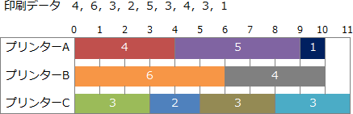

# [令和4年秋期 午前 問19](https://www.ap-siken.com/kakomon/04_aki/q19.html)

#問題 #テクノロジ #ソフトウェア #オペレーティングシステム

解説を表示解説を隠す

<strong>問19</strong>　LANに接続された3台のプリンターA～Cがある。印刷時間が分単位で4，6，3，2，5，3，4，3，1の9個の印刷データがこの順で存在する場合，プリンターCが印刷に要する時間は何分か。ここで，プリンターは，複数台空いていれば，A，B，Cの順で割り当て，1台も空いていなければ，どれかが空くまで待ちになる。また，初期状態では3台とも空いている。

<ul class="ap-choices">
<li class="ap-choice-item ap-wrong">

ア　7

割り当て順序や終了時刻の追跡を誤ると得られうる値であり，本問の条件ではない。

</li>
<li class="ap-choice-item ap-wrong">

イ　9

プリンターCの終了時刻を他のプリンターと取り違えるなど，<a href="用語/スケジュール" class="internal-link" data-href="用語/スケジュール">スケジュール</a>の追跡を誤ると得られうる値である。

</li>
<li class="ap-choice-item ap-correct">

ウ　11

正しい。設問の割り当て規則に従って各印刷データを割り当てると，プリンターCの最後の印刷は11分時点で終了する。

</li>
<li class="ap-choice-item ap-wrong">

エ　12

全プリンターの完了時刻と混同するなど，割り当て終了時刻の読み取りを誤ると得られうる値である。

</li>
</ul>

<h4>解説</h4>

設問の条件に従って3台のプリンターに印刷データを割り当てていくと以下のようになります。

開始時Aに4分の印刷データを割り当てる（終了は4分時点）。 Bに6分の印刷データを割り当てる（終了は6分時点）。 Cに3分の印刷データを割り当てる（終了は3分時点）。

3分後Cの印刷が終了するので，Cに2分の印刷データを割り当てる（終了は5分時点）。 4分後Aの印刷が終了するので，Aに5分の印刷データを割り当てる（終了は9分時点）。 5分後Cの印刷が終了するので，Cに3分の印刷データを割り当てる（終了は8分時点）。

6分後Bの印刷が終了するので，Bに4分の印刷データを割り当てる（終了は10分時点）。 8分後Cの印刷が終了するので，Cに3分の印刷データを割り当てる（終了は11分時点）。 9分後Aの印刷が終了するので，Aに1分の印刷データを割り当てる（終了は10分時点）。

10分後AとBの印刷が終了，11分後Cの印刷が終了。したがって，プリンターCの印刷時間は「11分」となります。

