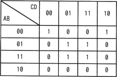
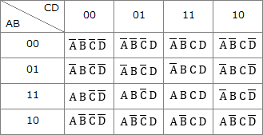
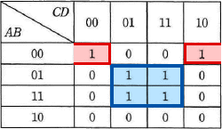

# [令和4年秋期 午前 問2](https://www.ap-siken.com/kakomon/04_aki/q2.html)

#問題 #テクノロジ #基礎理論 #離散数学

解説を表示解説を隠す

<strong>問2</strong>　A，B，C，Dを論理変数とするとき，次のカルノー図と等価な論理式はどれか。ここで，・は論理積，＋は論理和，XはXの否定を表す。 

<ul class="ap-choices">
<li class="ap-choice-item ap-wrong">

ア　A・B・C・D＋B・D

赤枠・青枠のグループ化から得られる<a href="用語/論理式" class="internal-link" data-href="用語/論理式">論理式</a>と一致しない。

</li>
<li class="ap-choice-item ap-wrong">

イ　A・B・C・D＋B・D

4変数すべてを<a href="用語/否定" class="internal-link" data-href="用語/否定">否定</a>した積項とB・Dの和であり，設問のカルノー図と等価ではない。

</li>
<li class="ap-choice-item ap-wrong">

ウ　A・B・D＋B・D

A・B・Dの項がなく，赤枠グループに対応する積項が欠けている。

</li>
<li class="ap-choice-item ap-correct">

エ　A・B・D＋B・D

正しい。2つのグループの<a href="用語/論理積" class="internal-link" data-href="用語/論理積">論理積</a>を<a href="用語/論理和" class="internal-link" data-href="用語/論理和">論理和</a>でつなぐとこの式になる。

</li>
</ul>

<h4>解説</h4>

カルノー図は、行・列それぞれの論理変数の組合せの結果が"真"となる場合に"1"を、"偽"となる場合に"0"を、その該当セルに書きこむことで<a href="用語/論理式" class="internal-link" data-href="用語/論理式">論理式</a>を図式化したものです。論理回路を簡略化するために用いられます。

設問のカルノー図の"1"と"0"、4つの論理変数は下図のように対応します。

カルノー図から<a href="用語/論理式" class="internal-link" data-href="用語/論理式">論理式</a>を導くには、図中の値が"1"のセルをグループ化して共通項を取り出すという手順を踏みます。このグループ化は次の4つのルールに従って行います。

<ol><li>値が"1"のセルすべてを長方形で囲むこと</li><li>グループに含まれるセルの数は2n（1, 2, 4, 8, …）であること</li><li>カルノー図の上下左右の端は連続していると考える</li><li>1つのセルが複数のグループに属してもよい</li></ol>

このルールに従って設問のカルノー図をグループ化すると、下図のように2つの長方形ですべての"1"を囲むことができます。

次にグループごとに論理変数の組から共通項を取り出して、その<a href="用語/論理積" class="internal-link" data-href="用語/論理積">論理積</a>を作ります。

<dl><dt>赤枠で囲ったグループ</dt><dd>論理変数の組は A B C D と A B C D なので、共通項は A B D、<a href="用語/論理積" class="internal-link" data-href="用語/論理積">論理積</a>は A・B・D</dd><dt>青枠で囲ったグループ</dt><dd>論理変数の組は A B C D、A B C D、A B C D、A B C D なので、共通項はB D、<a href="用語/論理積" class="internal-link" data-href="用語/論理積">論理積</a>はB・D</dd></dl>

最後に、グループごとの<a href="用語/論理積" class="internal-link" data-href="用語/論理積">論理積</a>同士を<a href="用語/論理和" class="internal-link" data-href="用語/論理和">論理和</a>でつなぐことで、図と等価な<a href="用語/論理式" class="internal-link" data-href="用語/論理式">論理式</a>が得られます。

赤枠グループの<a href="用語/論理積" class="internal-link" data-href="用語/論理積">論理積</a>は「A・B・D」、青枠グループの<a href="用語/論理積" class="internal-link" data-href="用語/論理積">論理積</a>は「B・D」であり、この2つを<a href="用語/論理和" class="internal-link" data-href="用語/論理和">論理和</a>（＋）でつなぐと「A・B・D＋B・D」になります。したがって「エ」が正解です。

