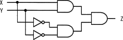
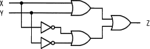
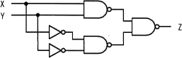
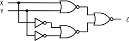
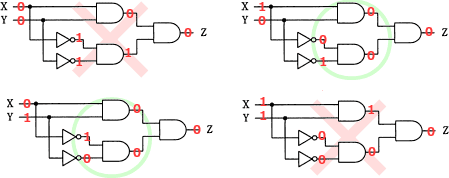
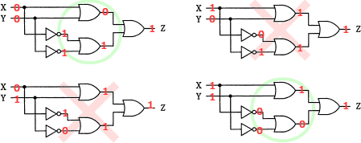
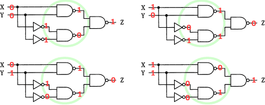
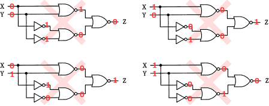

# [令和4年秋期 午前 問23](https://www.ap-siken.com/kakomon/04_aki/q23.html)

#問題 #テクノロジ #ハードウェア

解説を表示解説を隠す

<strong>問23</strong>　入力XとYの値が同じときにだけ，出力Zに1を出力する回路はどれか。

<ul class="ap-choices">
<li class="ap-choice-item ap-wrong">

ア　

(0，0)と(1，1)で1にならない、または(1，0)と(0，1)で1を出力するなど、XとYが同じときだけ1という条件を満たしません（解説の<a href="用語/真理値表" class="internal-link" data-href="用語/真理値表">真理値表</a>参照）。

</li>
<li class="ap-choice-item ap-wrong">

イ　

(0，0)と(1，1)で1にならない、または(1，0)と(0，1)で1を出力するなど、XとYが同じときだけ1という条件を満たしません（解説の<a href="用語/真理値表" class="internal-link" data-href="用語/真理値表">真理値表</a>参照）。

</li>
<li class="ap-choice-item ap-correct">

ウ　

正しい。(0，0)と(1，1)のとき1を出力し、(1，0)と(0，1)のとき0となる回路です。

</li>
<li class="ap-choice-item ap-wrong">

エ　

(0，0)と(1，1)で1にならない、または(1，0)と(0，1)で1を出力するなど、XとYが同じときだけ1という条件を満たしません（解説の<a href="用語/真理値表" class="internal-link" data-href="用語/真理値表">真理値表</a>参照）。

</li>
</ul>

<h4>解説</h4>

「入力XとYの値が同じときにだけ，出力Zに1を出力する」ということは、裏を返せば「入力XとYの値が異なるときには1を出力しない」ということです。このため、(X，Y)が(0，0)と(1，1)のときに1を出力するかどうかだけでなく、それ以外の(1，0)と(0，1)のときに出力が0になっているかどうかも確認する必要があります。

それぞれの論理回路に(0，0)、(1，0)、(0，1)、(1，1)の4つを入力して得られる結果は次のようになります。XとYが同じときに1を出力しているもの、XとYが異なるときに1を出力していないものには○を、そうではないものには×を付けてあります。

したがって、設問の条件に合致した出力をする論理回路は「ウ」です。

