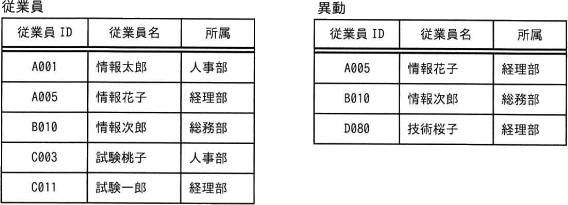
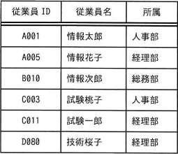
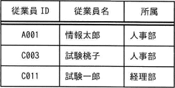
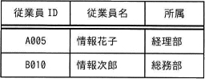
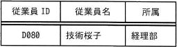
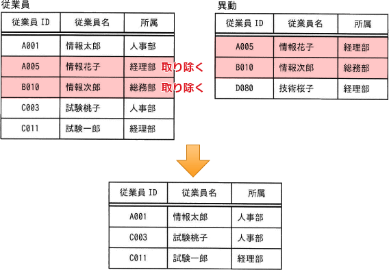

# [令和4年秋期 午前 問27](https://www.ap-siken.com/kakomon/04_aki/q27.html)

#問題 #テクノロジ #データベース #データ操作

解説を表示解説を隠す

<strong>問27</strong>　"従業員"表に対して"異動"表による差集合演算を行った結果はどれか。 

<ul class="ap-choices">
<li class="ap-choice-item ap-wrong">

ア　

2つの表の行が足し合わされているので、<a href="用語/和集合" class="internal-link" data-href="用語/和集合">和集合</a>演算を行った結果です。

</li>
<li class="ap-choice-item ap-correct">

イ　

正しい。"従業員"表に対して"異動"表による差集合演算を行った結果です。

</li>
<li class="ap-choice-item ap-wrong">

ウ　

2つの表で共通する行が表示されているので、積(共通)集合演算を行った結果です。

</li>
<li class="ap-choice-item ap-wrong">

エ　

"異動"表から"従業員"表に含まれる行を除いているので、"異動"表に対して"従業員"表による差集合演算を行った結果です。

</li>
</ul>

<h4>解説</h4>

差集合演算は、ある<a href="用語/関係" class="internal-link" data-href="用語/関係">関係</a>に含まれる行(<a href="用語/タプル" class="internal-link" data-href="用語/タプル">タプル</a>)のうち、他方の<a href="用語/関係" class="internal-link" data-href="用語/関係">関係</a>に含まれる行を取り除いた集合を返す演算です。<a href="用語/SQL" class="internal-link" data-href="用語/SQL">SQL</a>文では2つの表の差集合を得るのにEXCEPTを使います。

"従業員"表に対して"異動"表による差集合演算を行うと、"従業員"表から"異動"表に含まれる行を除いたものが結果が返されることになります。"従業員"表と"異動"表で共通している行は、{A005, 情報花子, 経理部}と{B010, 情報次郎, 総務部}の2つですから、"従業員"表からこの2行を取り除いた3行が結果として返されます。

したがって「イ」が正解です。

