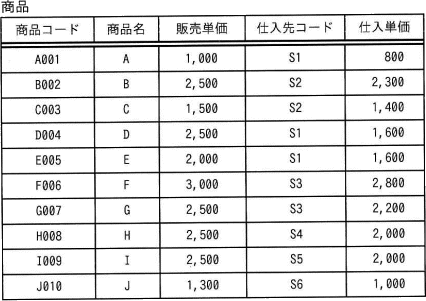
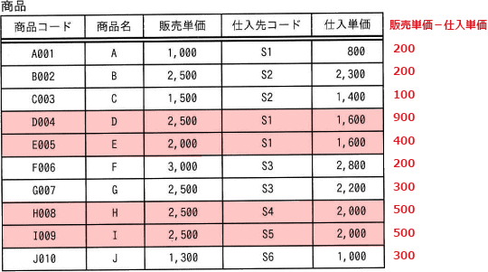
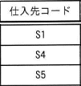

# [令和4年秋期 午前 問28](https://www.ap-siken.com/kakomon/04_aki/q28.html)

#問題 #テクノロジ #データベース #データ操作

解説を表示解説を隠す

<strong>問28</strong>　"商品"表に対して，次のSQL文を実行して得られる仕入先コード数は幾つか。 〔SQL文〕 SELECT DISTINCT 仕入先コード FROM 商品 WHERE (販売単価 - 仕入単価) &gt; (SELECT AVG (販売単価 - 仕入単価) FROM 商品) 

<ul class="ap-choices">
<li class="ap-choice-item ap-wrong">

ア　1

本問の<a href="用語/SQL" class="internal-link" data-href="用語/SQL">SQL</a>の実行結果ではありません。

</li>
<li class="ap-choice-item ap-wrong">

イ　2

本問の<a href="用語/SQL" class="internal-link" data-href="用語/SQL">SQL</a>の実行結果ではありません。

</li>
<li class="ap-choice-item ap-correct">

ウ　3

正しい。粗利益が平均を上回る行から仕入先コードをDISTINCTで重複除去すると3つです。

</li>
<li class="ap-choice-item ap-wrong">

エ　4

WHEREで該当する行は4行ですが，DISTINCTにより仕入先コードの重複は1つにまとめられます。

</li>
</ul>

<h4>解説</h4>

まず、<a href="用語/副問合せ" class="internal-link" data-href="用語/副問合せ">副問合せ</a>の部分から考えていきます。

SELECT AVG (販売単価 - 仕入単価) FROM 商品

この<a href="用語/SQL" class="internal-link" data-href="用語/SQL">SQL</a>文は、"商品"表の各行について販売単価から仕入単価を差し引いた値（粗利益）を求め、その<a href="用語/平均値" class="internal-link" data-href="用語/平均値">平均値</a>を返すものです。全商品の粗利益の<a href="用語/平均値" class="internal-link" data-href="用語/平均値">平均値</a>は、

(200＋200＋100＋900＋400＋200＋300＋500＋500＋300)÷10＝360

なので、<a href="用語/副問合せ" class="internal-link" data-href="用語/副問合せ">副問合せ</a>は360という単一値を返します。

<a href="用語/副問合せ" class="internal-link" data-href="用語/副問合せ">副問合せ</a>の結果を<a href="用語/SQL" class="internal-link" data-href="用語/SQL">SQL</a>文に代入すると以下のようになります。

SELECT DISTINCT 仕入先コード FROM 商品 WHERE (販売単価 - 仕入単価) &gt; 360

主問合せ側のWHERE句では、"商品"表の行のうち粗利益（販売単価－仕入単価）が全商品の平均粗利益である360を上回る行が選択されます。粗利益が360より大きいのは、商品D、商品E、商品H、商品Iの4つです。

この4行から成る中間表から、仕入先コード列が抽出されます。このとき、DISTINCTがあるので重複する行は1つにまとめられます。

したがって、結果表に含まれる仕入先コード数は「3つ」となります。

