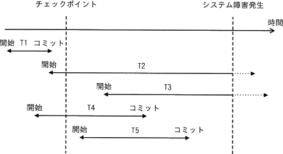
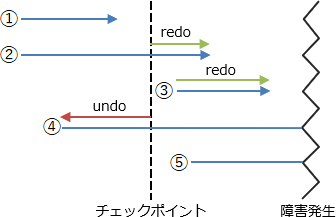

# [令和4年秋期 午前 問29](https://www.ap-siken.com/kakomon/04_aki/q29.html)

#問題 #テクノロジ #データベース #トランザクション処理

解説を表示解説を隠す

<strong>問29</strong>　チェックポイントを取得するDBMSにおいて，図のような時間経過でシステム障害が発生した。前進復帰(ロールフォワード)によって障害回復できるトランザクションだけを全て挙げたものはどれか。 

<ul class="ap-choices">
<li class="ap-choice-item ap-wrong">

ア　T1

<a href="用語/チェックポイント" class="internal-link" data-href="用語/チェックポイント">チェックポイント</a>前にコミット済みのため，復帰後の<a href="用語/データベース" class="internal-link" data-href="用語/データベース">データベース</a>に既に反映されており，<a href="用語/ロールフォワード" class="internal-link" data-href="用語/ロールフォワード">ロールフォワード</a>の対象ではありません。

</li>
<li class="ap-choice-item ap-wrong">

イ　T2 と T3

<a href="用語/トランザクション" class="internal-link" data-href="用語/トランザクション">トランザクション</a>処理中に障害が起こったため，原子性に基づき<a href="用語/ロールバック" class="internal-link" data-href="用語/ロールバック">ロールバック</a>の対象です。<a href="用語/ロールフォワード" class="internal-link" data-href="用語/ロールフォワード">ロールフォワード</a>の対象ではありません。

</li>
<li class="ap-choice-item ap-correct">

ウ　T4 と T5

正しい。<a href="用語/チェックポイント" class="internal-link" data-href="用語/チェックポイント">チェックポイント</a>後・障害発生前にコミットされた<a href="用語/トランザクション" class="internal-link" data-href="用語/トランザクション">トランザクション</a>であり，永続性に基づき<a href="用語/ロールフォワード" class="internal-link" data-href="用語/ロールフォワード">ロールフォワード</a>の対象です。

</li>
<li class="ap-choice-item ap-wrong">

エ　T5

T5だけでなく，<a href="用語/チェックポイント" class="internal-link" data-href="用語/チェックポイント">チェックポイント</a>後にコミットしたT4も<a href="用語/ロールフォワード" class="internal-link" data-href="用語/ロールフォワード">ロールフォワード</a>の対象です。

</li>
</ul>

<h4>解説</h4>

<a href="用語/ロールフォワード" class="internal-link" data-href="用語/ロールフォワード">ロールフォワード</a>(前進復帰)は、<a href="用語/データベース" class="internal-link" data-href="用語/データベース">データベース</a>システムに障害が起こったとき、<a href="用語/トランザクション" class="internal-link" data-href="用語/トランザクション">トランザクション</a>の更新後ログを使用することで過去に処理した<a href="用語/トランザクション" class="internal-link" data-href="用語/トランザクション">トランザクション</a>を再現し、システム障害の直前まで<a href="用語/データベース" class="internal-link" data-href="用語/データベース">データベース</a>の状態を回復させる処理です。

システム障害から復帰すると、<a href="用語/データベース" class="internal-link" data-href="用語/データベース">データベース</a>の状態は<a href="用語/チェックポイント" class="internal-link" data-href="用語/チェックポイント">チェックポイント</a>時点のデータに戻ります。<a href="用語/トランザクション" class="internal-link" data-href="用語/トランザクション">トランザクション</a>には、処理がすべて実行されるか・全く実行されないかのどちらか終了する性質（原子性）と、一旦正常終了した<a href="用語/トランザクション" class="internal-link" data-href="用語/トランザクション">トランザクション</a>の結果は、その後システムに障害が発生しても失われない性質（永続性）が要求されますから、復帰後はこの性質を満たすために<a href="用語/ロールフォワード" class="internal-link" data-href="用語/ロールフォワード">ロールフォワード</a>や<a href="用語/ロールバック" class="internal-link" data-href="用語/ロールバック">ロールバック</a>が行われます。

図の5つの<a href="用語/トランザクション" class="internal-link" data-href="用語/トランザクション">トランザクション</a>は、復帰後の対処によって3つのグループに分かれます。T1<a href="用語/チェックポイント" class="internal-link" data-href="用語/チェックポイント">チェックポイント</a>前にコミットされているので、コミットの内容は復帰後の<a href="用語/データベース" class="internal-link" data-href="用語/データベース">データベース</a>に反映されている。よって、何もしない。T2、T3<a href="用語/トランザクション" class="internal-link" data-href="用語/トランザクション">トランザクション</a>処理中に障害が起こったので、原子性に基づき、<a href="用語/データベース" class="internal-link" data-href="用語/データベース">データベース</a>を<a href="用語/トランザクション" class="internal-link" data-href="用語/トランザクション">トランザクション</a>開始前の状態に戻す。よって、<a href="用語/ロールバック" class="internal-link" data-href="用語/ロールバック">ロールバック</a>を行う。T4、T5<a href="用語/チェックポイント" class="internal-link" data-href="用語/チェックポイント">チェックポイント</a>後、障害発生前にコミットがあったので、永続性に基づき、失われたコミットの内容を復帰後の<a href="用語/データベース" class="internal-link" data-href="用語/データベース">データベース</a>に反映させる。よって、<a href="用語/ロールフォワード" class="internal-link" data-href="用語/ロールフォワード">ロールフォワード</a>を行う。

以上より、前進復帰の対象となるのは「最後の<a href="用語/チェックポイント" class="internal-link" data-href="用語/チェックポイント">チェックポイント</a>からシステム障害発生までの間」にコミットされた<a href="用語/トランザクション" class="internal-link" data-href="用語/トランザクション">トランザクション</a>となります。したがって正解は「T4とT5」です。

