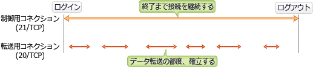

# [令和4年秋期 午前 問32](https://www.ap-siken.com/kakomon/04_aki/q32.html)

#問題 #テクノロジ #ネットワーク #通信プロトコル

解説を表示解説を隠す

<strong>問32</strong>　TCP/IPネットワークで，データ転送用と制御用とに異なるウェルノウンポート番号が割り当てられているプロトコルはどれか。

<ul class="ap-choices">
<li class="ap-choice-item ap-correct">

ア　FTP

正しい。<a href="用語/FTP" class="internal-link" data-href="用語/FTP">FTP</a>ではデータの転送用に「20/<a href="用語/TCP" class="internal-link" data-href="用語/TCP">TCP</a>」、制御用に「21/<a href="用語/TCP" class="internal-link" data-href="用語/TCP">TCP</a>」が割り当てられています。制御用(21/<a href="用語/TCP" class="internal-link" data-href="用語/TCP">TCP</a>)は、ファイルをダウンロードするGET(RETR)やアップロードのPUT(STOR)などのコマンド送信と、その応答をやり取りするためのコネクション、データ転送用(20/<a href="用語/TCP" class="internal-link" data-href="用語/TCP">TCP</a>)は、制御用のコネクションとは別にデータの転送処理が発生する度に確立されるコネクションです。

</li>
<li class="ap-choice-item ap-wrong">

イ　POP3

<a href="用語/POP3" class="internal-link" data-href="用語/POP3">POP3</a>が使用するポートは「110/<a href="用語/TCP" class="internal-link" data-href="用語/TCP">TCP</a>」だけです。

</li>
<li class="ap-choice-item ap-wrong">

ウ　SMTP

<a href="用語/SMTP" class="internal-link" data-href="用語/SMTP">SMTP</a>では通常のメール転送用に「25/<a href="用語/TCP" class="internal-link" data-href="用語/TCP">TCP</a>」、メールソフトからメールサーバに届けるときの送信専用の宛先ポート(サブミッションポート)に「587/<a href="用語/TCP" class="internal-link" data-href="用語/TCP">TCP</a>」を使用します。

</li>
<li class="ap-choice-item ap-wrong">

エ　SNMP

SNMPではマネージャ側からエージェントに通知するときに「161/<a href="用語/UDP" class="internal-link" data-href="用語/UDP">UDP</a>」、逆にエージェント側からマネージャに通知するときに「162/<a href="用語/UDP" class="internal-link" data-href="用語/UDP">UDP</a>」を使用します。

</li>
</ul>

<h4>解説</h4>

ウェルノウン<a href="用語/ポート番号" class="internal-link" data-href="用語/ポート番号">ポート番号</a>とは、16ビットの<a href="用語/ポート番号" class="internal-link" data-href="用語/ポート番号">ポート番号</a> 0～65535 のうち、よく利用される特定のアプリケーション用に予約されている 0～1023 までの番号のことです。ウェルノウン(well-known)は、英語で「よく知られている、有名な」という意味の形容詞です。システムポートとも呼ばれます。

情報処理技術者試験でも出題可能性がある、下記のプロトコルと<a href="用語/ポート番号" class="internal-link" data-href="用語/ポート番号">ポート番号</a>の組みについては押さえておきましょう。<a href="用語/HTTP" class="internal-link" data-href="用語/HTTP">HTTP</a>　80/<a href="用語/TCP" class="internal-link" data-href="用語/TCP">TCP</a>　<a href="用語/HTTPS" class="internal-link" data-href="用語/HTTPS">HTTPS</a>　443/<a href="用語/TCP" class="internal-link" data-href="用語/TCP">TCP</a>　<a href="用語/FTP" class="internal-link" data-href="用語/FTP">FTP</a>　20/<a href="用語/TCP" class="internal-link" data-href="用語/TCP">TCP</a>、21/<a href="用語/TCP" class="internal-link" data-href="用語/TCP">TCP</a>　<a href="用語/SSH" class="internal-link" data-href="用語/SSH">SSH</a>　22/<a href="用語/TCP" class="internal-link" data-href="用語/TCP">TCP</a>　<a href="用語/SMTP" class="internal-link" data-href="用語/SMTP">SMTP</a>　25/<a href="用語/TCP" class="internal-link" data-href="用語/TCP">TCP</a>　<a href="用語/POP3" class="internal-link" data-href="用語/POP3">POP3</a>　110/<a href="用語/TCP" class="internal-link" data-href="用語/TCP">TCP</a>　<a href="用語/DNS" class="internal-link" data-href="用語/DNS">DNS</a>　53/<a href="用語/TCP" class="internal-link" data-href="用語/TCP">TCP</a>、53/<a href="用語/UDP" class="internal-link" data-href="用語/UDP">UDP</a>　<a href="用語/NTP" class="internal-link" data-href="用語/NTP">NTP</a>　123/<a href="用語/UDP" class="internal-link" data-href="用語/UDP">UDP</a>

