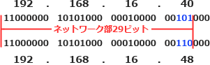
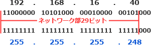

# [令和4年秋期 午前 問33](https://www.ap-siken.com/kakomon/04_aki/q33.html)

#問題 #テクノロジ #ネットワーク #通信プロトコル

解説を表示解説を隠す

<strong>問33</strong>　IPv4のネットワークアドレスが 192.168.16.40/29 のとき，適切なものはどれか。

<ul class="ap-choices">
<li class="ap-choice-item ap-wrong">

ア　192.168.16.48 は同一サブネットワーク内のIPアドレスである。

"/29"は<a href="用語/IPアドレス" class="internal-link" data-href="用語/IPアドレス">IPアドレス</a>の上位29<a href="用語/ビット" class="internal-link" data-href="用語/ビット">ビット</a>がネットワークアドレスであることを示します。2つの<a href="用語/IPアドレス" class="internal-link" data-href="用語/IPアドレス">IPアドレス</a>を<a href="用語/ビット" class="internal-link" data-href="用語/ビット">ビット</a>に直して比べるとネットワークアドレスが異なるので、2つの<a href="用語/IPアドレス" class="internal-link" data-href="用語/IPアドレス">IPアドレス</a>はそれぞれ異なるサブネットワークに属します。 

</li>
<li class="ap-choice-item ap-wrong">

イ　サブネットマスクは，255.255.255.240 である。

<a href="用語/IPアドレス" class="internal-link" data-href="用語/IPアドレス">IPアドレス</a>の上位29<a href="用語/ビット" class="internal-link" data-href="用語/ビット">ビット</a>の部分を"1"に、それ以外の<a href="用語/ビット" class="internal-link" data-href="用語/ビット">ビット</a>を"0"にしたものが<a href="用語/サブネットマスク" class="internal-link" data-href="用語/サブネットマスク">サブネットマスク</a>になります。192.168.16.40/29 の<a href="用語/サブネットマスク" class="internal-link" data-href="用語/サブネットマスク">サブネットマスク</a>は、255.255.255.248 です。 

</li>
<li class="ap-choice-item ap-correct">

ウ　使用可能なホストアドレスは最大6個である。

正しい。ホスト部は3<a href="用語/ビット" class="internal-link" data-href="用語/ビット">ビット</a>なので、<a href="用語/ビット" class="internal-link" data-href="用語/ビット">ビット</a>列の組合せは2の3乗＝8です。その8個から3<a href="用語/ビット" class="internal-link" data-href="用語/ビット">ビット</a>すべてが0のネットワークアドレスとすべてが1の<a href="用語/ブロードキャスト" class="internal-link" data-href="用語/ブロードキャスト">ブロードキャスト</a>アドレスを除いた6個が使用可能なホストアドレスになります。

</li>
<li class="ap-choice-item ap-wrong">

エ　ホスト部は29ビットである。

32<a href="用語/ビット" class="internal-link" data-href="用語/ビット">ビット</a>中、ネットワーク部が29<a href="用語/ビット" class="internal-link" data-href="用語/ビット">ビット</a>でホスト部は3<a href="用語/ビット" class="internal-link" data-href="用語/ビット">ビット</a>です。

</li>
</ul>

<h4>解説</h4>

"/29"は<a href="用語/IPアドレス" class="internal-link" data-href="用語/IPアドレス">IPアドレス</a>の上位29<a href="用語/ビット" class="internal-link" data-href="用語/ビット">ビット</a>がネットワークアドレスであることを示します。ホスト部は3<a href="用語/ビット" class="internal-link" data-href="用語/ビット">ビット</a>なので、<a href="用語/ビット" class="internal-link" data-href="用語/ビット">ビット</a>列の組合せは2の3乗＝8です。その8個から3<a href="用語/ビット" class="internal-link" data-href="用語/ビット">ビット</a>すべてが0のネットワークアドレスとすべてが1の<a href="用語/ブロードキャスト" class="internal-link" data-href="用語/ブロードキャスト">ブロードキャスト</a>アドレスを除いた6個が使用可能なホストアドレスになります。

