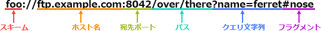

# [令和4年秋期 午前 問35](https://www.ap-siken.com/kakomon/04_aki/q35.html)

#問題 #テクノロジ #ネットワーク #ネットワーク応用

解説を表示解説を隠す

<strong>問35</strong>　次のURLに対し，受理するWebサーバのポート番号(8080)を指定できる箇所はどれか。 https://www.example.com/member/login?id=user

<ul class="ap-choices">
<li class="ap-choice-item ap-wrong">

ア　クエリ文字列(id=user)の直後 https://www.example.com/member/login?id=user:8080

クエリ文字列の直後に<a href="用語/ポート番号" class="internal-link" data-href="用語/ポート番号">ポート番号</a>を付ける形式は、<a href="用語/URL" class="internal-link" data-href="用語/URL">URL</a>の構文として規定されていません。

</li>
<li class="ap-choice-item ap-wrong">

イ　スキーム(https)の直後 https:8080://www.example.com/member/login?id=user

スキームの直後に<a href="用語/ポート番号" class="internal-link" data-href="用語/ポート番号">ポート番号</a>を付ける形式は、<a href="用語/URL" class="internal-link" data-href="用語/URL">URL</a>の構文として規定されていません。

</li>
<li class="ap-choice-item ap-wrong">

ウ　パス(/member/login)の直後 https://www.example.com/member/login:8080?id=user

パスの直後に<a href="用語/ポート番号" class="internal-link" data-href="用語/ポート番号">ポート番号</a>を付ける形式は、<a href="用語/URL" class="internal-link" data-href="用語/URL">URL</a>の構文として規定されていません。

</li>
<li class="ap-choice-item ap-correct">

エ　ホスト名(www.example.com)の直後 https://www.example.com:8080/member/login?id=user

正しい。<a href="用語/URL" class="internal-link" data-href="用語/URL">URL</a>で宛先の<a href="用語/ポート番号" class="internal-link" data-href="用語/ポート番号">ポート番号</a>を指定する場合、ホスト名の直後に「:」(コロン)と数字を加えます。

</li>
</ul>

<h4>解説</h4>

<a href="用語/URL" class="internal-link" data-href="用語/URL">URL</a>の一般的な構文は規定されています。<a href="用語/URL" class="internal-link" data-href="用語/URL">URL</a>で宛先の<a href="用語/ポート番号" class="internal-link" data-href="用語/ポート番号">ポート番号</a>を指定する場合、ホスト名の直後に「:」(コロン)と数字を加えます。したがって「エ」が正解です。

