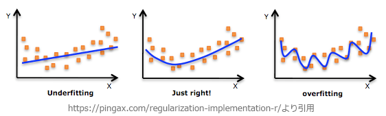

# [令和4年秋期 午前 問4](https://www.ap-siken.com/kakomon/04_aki/q4.html)

#問題 #テクノロジ #基礎理論 #情報に関する理論

解説を表示解説を隠す

<strong>問4</strong>　AIにおける過学習の説明として，最も適切なものはどれか。

<ul class="ap-choices">
<li class="ap-choice-item ap-wrong">

ア　ある領域で学習した学習済みモデルを，別の領域に再利用することによって，効率的に学習させる。

これは<a href="用語/転移学習" class="internal-link" data-href="用語/転移学習">転移学習</a>の説明です。

</li>
<li class="ap-choice-item ap-correct">

イ　学習に使った訓練データに対しては精度が高い結果となる一方で，未知のデータに対しては精度が下がる。

正しい。<a href="用語/過学習" class="internal-link" data-href="用語/過学習">過学習</a>の説明です。

</li>
<li class="ap-choice-item ap-wrong">

ウ　期待している結果とは掛け離れている場合に，結果側から逆方向に学習させて，その差を少なくする。

これは誤差逆伝播法(<a href="用語/バックプロパゲーション" class="internal-link" data-href="用語/バックプロパゲーション">バックプロパゲーション</a>)の説明です。

</li>
<li class="ap-choice-item ap-wrong">

エ　膨大な訓練データを学習させても効果が得られない場合に，学習目標として成功と判断するための報酬を与えることによって，何が成功か分かるようにする。

これは<a href="用語/強化学習" class="internal-link" data-href="用語/強化学習">強化学習</a>の説明です。

</li>
</ul>

<h4>解説</h4>

<a href="用語/過学習" class="internal-link" data-href="用語/過学習">過学習</a>(オーバーフィッティング)は、<a href="用語/機械学習" class="internal-link" data-href="用語/機械学習">機械学習</a>のモデルが訓練データに過剰に適合してしまった状態を指します。

モデルが<a href="用語/過学習" class="internal-link" data-href="用語/過学習">過学習</a>に陥ると、訓練データに対しては良い精度を示しますが、未知のデータに対する予測精度が低下し、汎用性がないシステムとなってしまいます。<a href="用語/過学習" class="internal-link" data-href="用語/過学習">過学習</a>は、訓練データが少ない場合やモデルの複雑度が高い場合に特に起きやすくなります。

したがって「イ」の説明が適切です。

