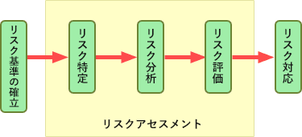

# [令和4年秋期 午前 問41](https://www.ap-siken.com/kakomon/04_aki/q41.html)

#問題 #テクノロジ #セキュリティ #情報セキュリティ管理

解説を表示解説を隠す

<strong>問41</strong>　JIS Q 31000:2019(リスクマネジメント－指針)におけるリスクアセスメントを構成するプロセスの組合せはどれか。

<ul class="ap-choices">
<li class="ap-choice-item ap-wrong">

ア　リスク特定，リスク評価，リスク受容

リスク受容は<a href="用語/リスク対応" class="internal-link" data-href="用語/リスク対応">リスク対応</a>の一形態であり、リスクアセスメントの構成要素ではありません。

</li>
<li class="ap-choice-item ap-correct">

イ　リスク特定，リスク分析，リスク評価

正しい。<a href="用語/JIS Q 31000" class="internal-link" data-href="用語/JIS Q 31000">JIS Q 31000</a>ではリスクアセスメントをこの3プロセスの組合せと定義しています。

</li>
<li class="ap-choice-item ap-wrong">

ウ　リスク分析，リスク対応，リスク受容

<a href="用語/リスク対応" class="internal-link" data-href="用語/リスク対応">リスク対応</a>・リスク受容はリスク処理の段階であり、リスクアセスメントには含まれません。

</li>
<li class="ap-choice-item ap-wrong">

エ　リスク分析，リスク評価，リスク対応

<a href="用語/リスク対応" class="internal-link" data-href="用語/リスク対応">リスク対応</a>はリスクアセスメントの後に行うリスク処理であり、構成要素ではありません。

</li>
</ul>

<h4>解説</h4>

<a href="用語/リスクマネジメント" class="internal-link" data-href="用語/リスクマネジメント">リスクマネジメント</a>の指針を示した規格である<a href="用語/JIS Q 31000" class="internal-link" data-href="用語/JIS Q 31000">JIS Q 31000</a>では、リスクアセスメントを「リスク特定，リスク分析及びリスク評価を網羅するプロセス全体を指す」と定義しています。したがって、正しい組合せは「リスク特定，リスク分析，リスク評価」の3つです。

リスク特定は、組織の目的の達成を助ける又は妨害する可能性のあるリスクを発見し，認識し，記述するプロセスです。リスク分析は、必要に応じてリスクのレベルを含め，リスクの性質及び特徴を理解するプロセスです。リスク評価は、リスク分析の結果と確立された<a href="用語/リスク基準" class="internal-link" data-href="用語/リスク基準">リスク基準</a>との比較をし，追加する行為の決定を裏付けるプロセスです。

