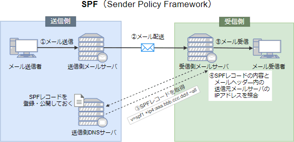

# [令和4年秋期 午前 問44](https://www.ap-siken.com/kakomon/04_aki/q44.html)

#問題 #テクノロジ #セキュリティ #情報セキュリティ対策

解説を表示解説を隠す

<strong>問44</strong>　SPF(Sender Policy Framework)の仕組みはどれか。

<ul class="ap-choices">
<li class="ap-choice-item ap-wrong">

ア　電子メールを受信するサーバが，電子メールに付与されているデジタル署名を使って，送信元ドメインの詐称がないことを確認する。

<a href="用語/SPF" class="internal-link" data-href="用語/SPF">SPF</a>では<a href="用語/デジタル署名" class="internal-link" data-href="用語/デジタル署名">デジタル署名</a>を使用しません。記述は<a href="用語/DKIM" class="internal-link" data-href="用語/DKIM">DKIM</a>(DomainKeys Identified Mail)の仕組みです。

</li>
<li class="ap-choice-item ap-correct">

イ　電子メールを受信するサーバが，電子メールの送信元のドメイン情報と，電子メールを送信したサーバのIPアドレスから，送信元ドメインの詐称がないことを確認する。

正しい。<a href="用語/SPF" class="internal-link" data-href="用語/SPF">SPF</a>の仕組みです。

</li>
<li class="ap-choice-item ap-wrong">

ウ　電子メールを送信するサーバが，電子メールの宛先のドメインや送信者のメールアドレスを問わず，全ての電子メールをアーカイブする。

メールアーカイブシステムの仕組みです。

</li>
<li class="ap-choice-item ap-wrong">

エ　電子メールを送信するサーバが，電子メールの送信者の上司からの承認が得られるまで，一時的に電子メールの送信を保留する。

メール誤送信防止システムの仕組みです。

</li>
</ul>

<h4>解説</h4>

<a href="用語/SPF" class="internal-link" data-href="用語/SPF">SPF</a>(Sender Policy Framework)は、メールを送信しようとしてきたメールサーバの<a href="用語/IPアドレス" class="internal-link" data-href="用語/IPアドレス">IPアドレス</a>情報を検証することで、正規のサーバからのメール送信であるかどうか確認することができる技術です。受信メールサーバ側がメールの送信元<a href="用語/ドメイン" class="internal-link" data-href="用語/ドメイン">ドメイン</a>を管理する<a href="用語/DNS" class="internal-link" data-href="用語/DNS">DNS</a>サーバに問い合わせ、返された<a href="用語/IPアドレス" class="internal-link" data-href="用語/IPアドレス">IPアドレス</a>が送信元メールサーバの<a href="用語/IPアドレス" class="internal-link" data-href="用語/IPアドレス">IPアドレス</a>と一致するかどうかで<a href="用語/なりすまし" class="internal-link" data-href="用語/なりすまし">なりすまし</a>を検知します。

<a href="用語/SPF" class="internal-link" data-href="用語/SPF">SPF</a>では以下の手順で<a href="用語/電子メール" class="internal-link" data-href="用語/電子メール">電子メール</a>の送信元<a href="用語/IPアドレス" class="internal-link" data-href="用語/IPアドレス">IPアドレス</a>の検証を行います。送信側は、送信側<a href="用語/ドメイン" class="internal-link" data-href="用語/ドメイン">ドメイン</a>の<a href="用語/DNS" class="internal-link" data-href="用語/DNS">DNS</a>サーバの<a href="用語/SPF" class="internal-link" data-href="用語/SPF">SPF</a>レコード(またはTXTレコード)に正当なメールサーバの<a href="用語/IPアドレス" class="internal-link" data-href="用語/IPアドレス">IPアドレス</a>やホスト名を登録し、公開しておく。送信側から受信側へ、<a href="用語/SMTP" class="internal-link" data-href="用語/SMTP">SMTP</a>メールが送信される。受信側メールサーバは、受信側<a href="用語/ドメイン" class="internal-link" data-href="用語/ドメイン">ドメイン</a>の<a href="用語/DNS" class="internal-link" data-href="用語/DNS">DNS</a>サーバを通じて、MAIL FROMコマンドに記載された送信者メールアドレスの<a href="用語/ドメイン" class="internal-link" data-href="用語/ドメイン">ドメイン</a>を管理する<a href="用語/DNS" class="internal-link" data-href="用語/DNS">DNS</a>サーバに問い合わせ、<a href="用語/SPF" class="internal-link" data-href="用語/SPF">SPF</a>情報を取得する。<a href="用語/SPF" class="internal-link" data-href="用語/SPF">SPF</a>情報との照合で<a href="用語/SMTP" class="internal-link" data-href="用語/SMTP">SMTP</a>接続してきたメールサーバの<a href="用語/IPアドレス" class="internal-link" data-href="用語/IPアドレス">IPアドレス</a>の確認に成功すれば、正当な<a href="用語/ドメイン" class="internal-link" data-href="用語/ドメイン">ドメイン</a>から送信されたと判断する。

この仕組みを踏まえて各選択肢の正誤を判断します。

