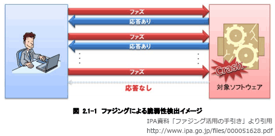

# [令和4年秋期 午前 問45](https://www.ap-siken.com/kakomon/04_aki/q45.html)

#問題 #テクノロジ #セキュリティ #セキュリティ技術評価

解説を表示解説を隠す

<strong>問45</strong>　ファジングに該当するものはどれか。

<ul class="ap-choices">
<li class="ap-choice-item ap-wrong">

ア　Webサーバに対し，ログイン，閲覧などのリクエストを大量に送り付け，一定時間内の処理量を計測して，DDoS攻撃に対する耐性を検査する。

<a href="用語/負荷テスト" class="internal-link" data-href="用語/負荷テスト">負荷テスト</a>やDDoS演習に関する記述です。

</li>
<li class="ap-choice-item ap-correct">

イ　ソフトウェアに対し，問題を起こしそうな様々な種類のデータを入力し，そのソフトウェアの動作状態を監視して脆弱性を発見する。

正しい。<a href="用語/ファジング" class="internal-link" data-href="用語/ファジング">ファジング</a>に関する記述です。

</li>
<li class="ap-choice-item ap-wrong">

ウ　パスワードとしてよく使われる文字列を数多く列挙したリストを使って，不正にログインを試行する。

<a href="用語/辞書攻撃" class="internal-link" data-href="用語/辞書攻撃">辞書攻撃</a>に関する記述です。

</li>
<li class="ap-choice-item ap-wrong">

エ　マークアップ言語で書かれた文字列を処理する前に，その言語にとって特別な意味をもつ文字や記号を別の文字列に置換して，脆弱性が悪用されるのを防止する。

サニタイジング(エスケープ処理)に関する記述です。

</li>
</ul>

<h4>解説</h4>

<a href="用語/ファジング" class="internal-link" data-href="用語/ファジング">ファジング</a>(fuzzing)とは、検査対象のソフトウェア製品に「ファズ（英名：fuzz）」と呼ばれる問題を引き起こしそうなデータを大量に送り込み、その応答や挙動を監視することで(未知の)<a href="用語/脆弱性" class="internal-link" data-href="用語/脆弱性">脆弱性</a>を検出する検査手法です。

<a href="用語/ファジング" class="internal-link" data-href="用語/ファジング">ファジング</a>は、ファズデータの生成、検査対象への送信、挙動の監視を自動で行う<a href="用語/ファジング" class="internal-link" data-href="用語/ファジング">ファジング</a>ツール(ファザー)と呼ばれるソフトウェアを使用して行います。開発ライフサイクルに<a href="用語/ファジング" class="internal-link" data-href="用語/ファジング">ファジング</a>を導入することで「バグや<a href="用語/脆弱性" class="internal-link" data-href="用語/脆弱性">脆弱性</a>の低減」「テストの自動化・効率化によるコスト削減」が期待できるため、大手企業の一部で徐々に活用され始めています。

